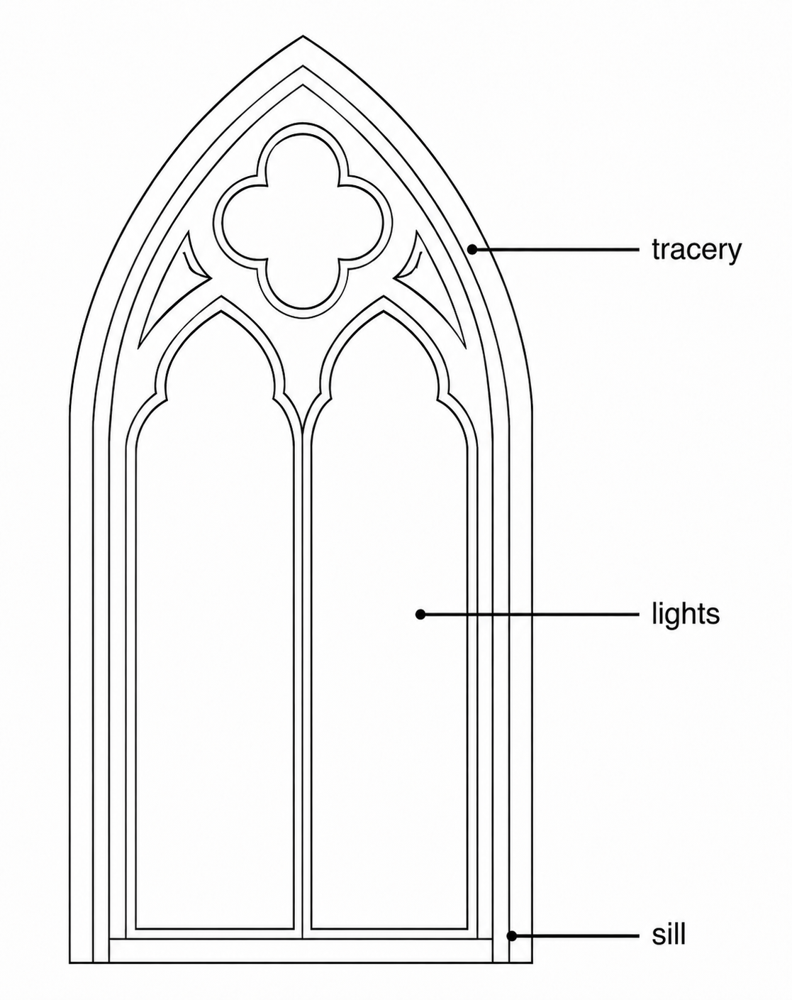
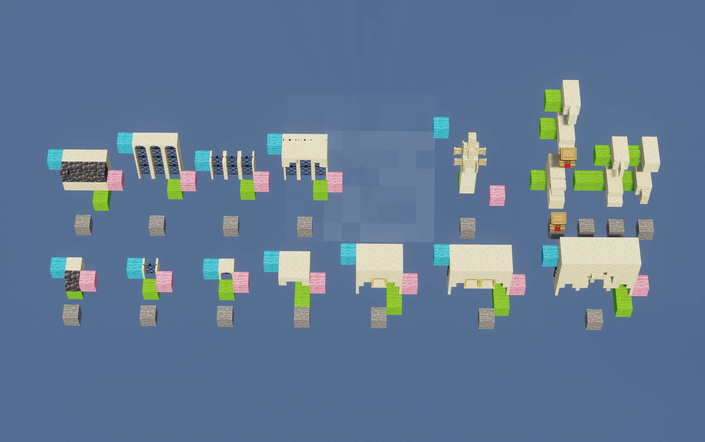
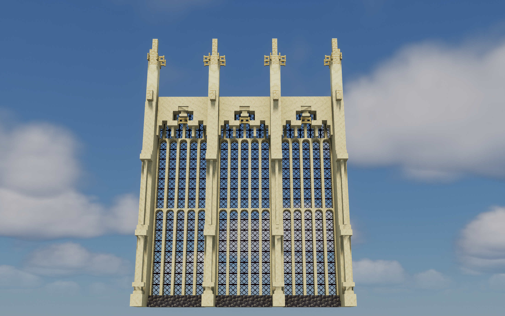
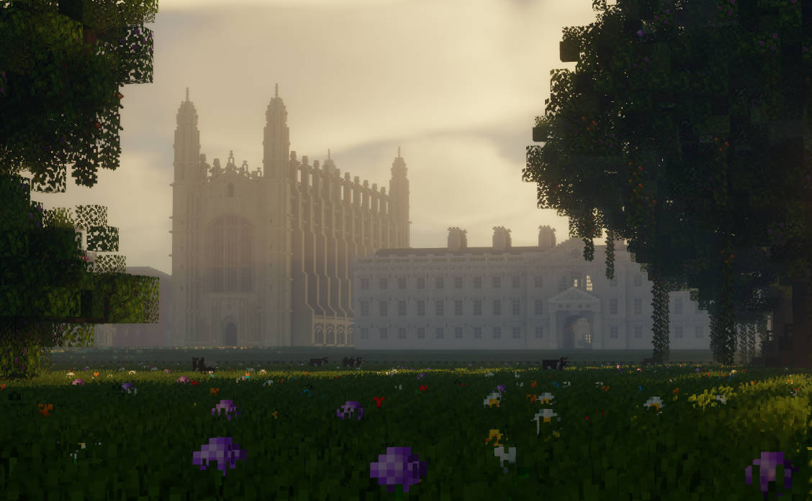
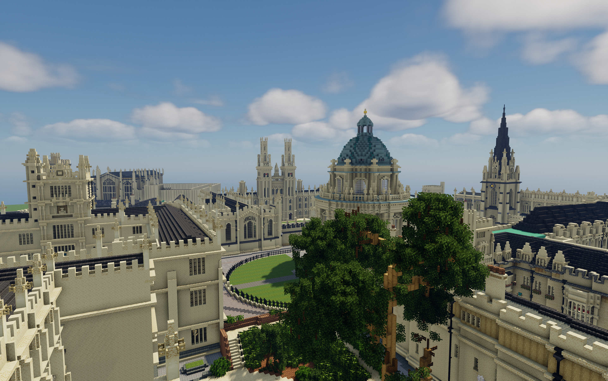
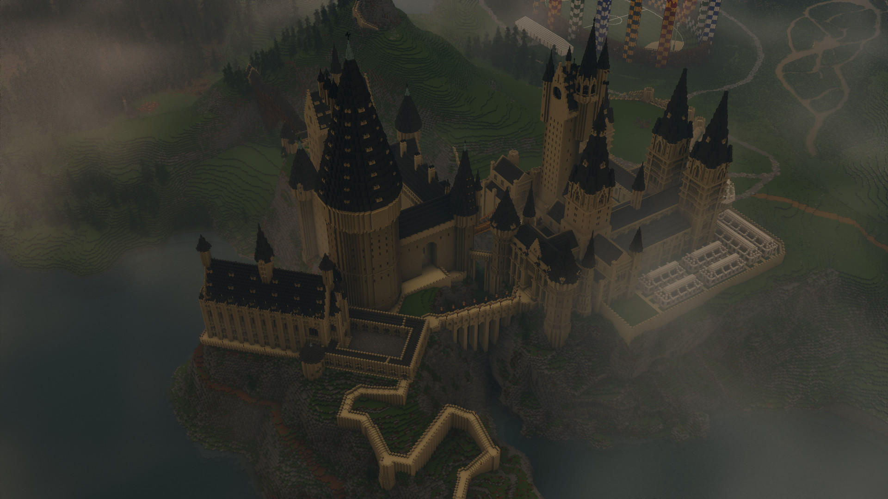
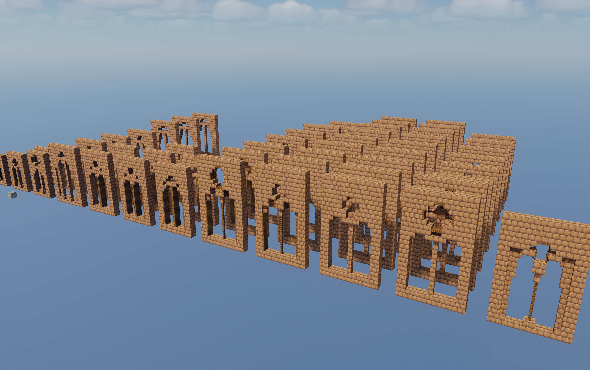
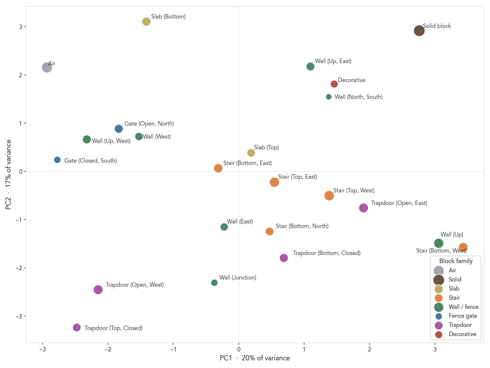
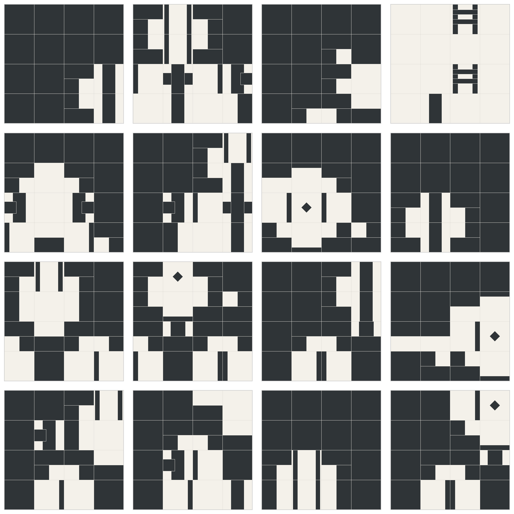
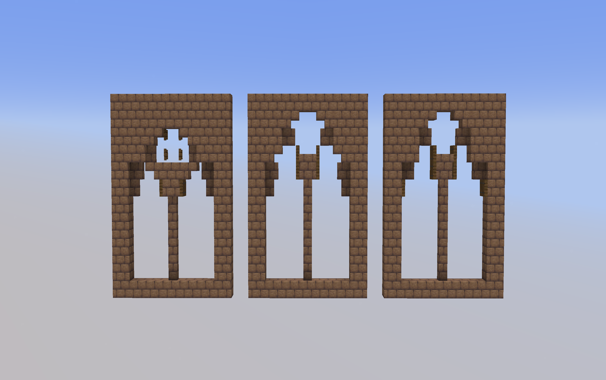

  <strong style="color: #3a85ed;">TL;DR:</strong>
  &nbsp;I trained a VQ-VAE to generate gothic arches in Minecraft.

If you know me, you probably know that I have spent a lot of time recreating places in Minecraft, notably [Hogwarts](../minecrafthogwarts), [Cambridge](../minecraftcambridge), and Oxford. 

This means I've been building a lot of slightly-different-but-not-really-different things - windows, buttresses, arches, roofs etc. To save time, it would be useful if a model could learn some of the architectural language, or even, generate entire buildings from 3D imagery. That's the end goal. But first let's focus on something smaller: windows. Specifically, Gothic-style windows as I'm fed up building them. 

Gothic windows are interesting because they follow rules: a **tracery** crown at the top, one or more **lights** beneath, and a **sill** at the base. The parts have to agree with each other. The lights are exactly as wide as the tracery that caps them, and the windows are symmetrical.

<figure style="position: relative; display: block; margin: 0 auto; text-align: center; border-radius: 12px; overflow: hidden;">
  
</figure>

<i>Gothic window diagram (ChatGPT)</i>

Therefore, they can effectively be built by stiching together lots of smaller sub-components according to these rules. I wrote a quick Python script[^1] which stitches together smaller builds to build a given WxH window section with H+h tall buttresses in between.

<figure style="display: flex; justify-content: center; gap: 10px; margin: 0 auto; text-align: center;">
  
  
</figure>

<i>Window subcomponents and a stiched together section with arguments: N_windows=3, width=5, height=19, sections=2, buttress=True, </i>

But this approach is limited because we are limited to the sub-components we've manually built and the rules which stitch them together. Instead, a learned approach may be better.

<figure style="display: flex; justify-content: center; gap: 10px; margin: 0 auto; text-align: center;">
  
  <!--  -->
  
</figure>

<i>King's College and Hogwarts in Minecraft</i>

## How do you tokenise blocks?

To train a model on blocks, we first need to turn blocks into a discrete sequence the model can read and predict. The simplest mapping would be to make a token for every block.

However, Minecraft has thousands of block types, and each one has a variety of possible block states, especially once you introduce debugged blocks - which way a stair is facing, how a wall connects to neighbours, or whether a trapdoor is open or closed. As of version 26.1, there are 29,834 distinct block-state configurations. A single wall block alone has 324 combinations. Thankfully I very rarely build with redstone dust. Redstone, alone, has 1,296 block states. If we provide all this raw information to a model, it could spend lots of its capacity learning that oak and spruce planks effectively serve the same function in building (besides block palette). Instead, we want the model to learn when to use a solid block, stairs, slabs, or walls. Therefore, we care about geometry, not the material.

When removing block type, and focusing only on block states relevant for windows, we arrive at a much shorter list of 37 tokens:

| Tokens | Examples |
|--------|---------|
| `AIR`, `FULL` | air; any solid full cube (stone, bricks, logs, planks…) |
| `SLAB_BOTTOM`, `SLAB_TOP` | bottom / top half-slab |
| `STAIR_BOT_N/S/E/W`, `STAIR_TOP_N/S/E/W` | oriented stairs (half × facing) |
| `PANE`, `GLASS` | glass pane or iron bars; full-block glass |
| `WALL_POST`, `WALL_E`, `WALL_W`, `WALL_NS`, `WALL_POST_E`, `WALL_POST_W`, `WALL` | wall / fence connection states |
| `GATE_CLOSED_*`, `GATE_OPEN_*` | oriented fence gates (open × facing) |
| `TRAP_TOP_CLOSED`, `TRAP_BOT_CLOSED`, `TRAP_OPEN_N/S/E/W` | trapdoors (position or open-facing) |
| `DECORATIVE` | torches, lanterns, buttons, pressure plates, chains, flower pots, doors… |
| `UNKNOWN` | unknown blocks which do not fall into the above tokens |

## Data

First we need training data. Turns out there isn't a clean dataset out there of Minecraft gothic-style arches ready for import into a model (damn). Given we're focusing specifically on windows as a place to start, I also didn't want to download various Minecraft maps off Planet Minecraft[^2] and extract window models.

*Yeah*. I sat down for multiple hours and built a tonne of slightly different windows. For now, I'm focusing on two-light windows with a width of 5 blocks.

<figure style="position: relative; display: inline-block; margin: 0; border-radius: 12px; overflow: hidden;">
  
</figure>

<i>Turns out creating lots of unique arches is really hard. </i>

I built 62 unique window arches (split 44/9/9). For a simple first attempt, we'll treat them as 1 block thick and not consider depth (depth usually permits more complex shapes). You'll notice that while the tracery of the windows varies between designs, the lights do less so - let's just focus on the tracery for now.

After tokenisation, I extract overlapping `4x4x1` patches with a stride of `2x2x1` from the tracery sections, giving us 188 training patches.

## VQ-VAE

I use a Vector Quantised-Variational AutoEncoder (VQ-VAE; [van den Oord et al., 2017](http://papers.nips.cc/paper/7210-neural-discrete-representation-learning.pdf)) From [Lilian Weng](https://lilianweng.github.io/posts/2018-08-12-vae/#vq-vae-and-vq-vae-2): 'a model learns a discrete latent variable by the encoder, since discrete representations may be a more natural fit for problems like language, speech, reasoning, etc.'  Minecraft is exactly one of these problems - block states are not continuous. The total number of possible patches based on our tokens is $\text{37}^{16}$, however  there are only a finite number of possible block combinations that look like sections of tracery - we want the VQ-VAE to learn various *motifs*.

**Encoder**

The encoder first embeds the token to a learned 16-dimensional embedding which is passed to  two 3D convolutional layers and then a global average pool collapses the whole patch down to a single 32-dimensional vector $z$. A `LayerNorm` then normalises it before quantisation.

**Quantiser**

The quantiser forces the continuous $z$ to become discrete. The codebook is a fixed set of $K=16$ learned 32-dimensional vectors which acts as our dictionary of motifs. The quantiser measures the L2 distance from $z$ to every codebook and snaps it to the nearest one[^3]. The index $I \in \mathbb{Z} [0, 15]$ is the patch's motif token. Importantly, the decoder never sees $z$, rather it only sees the codebook vector $z_q$ that $z$ was rounded to.

**Decoder**

The decoder consists of an upsampling blocks, followed by two convolutional + ReLU layers, and finally a 1x1 convolutional layer. It outputs a probability distribution over the possible tokens at every voxel. Reconstruction is then simply the argmax per voxel.

**Criterion**

I use a weighted cross entropy loss as the training objective. Given lots of the tracery is air, training on accuracy could cause the model to simply predict air. Therefore, the weight of each token in the cross entropy loss is set to its inverse frequency in the training dataset.

## From motifs to layouts

Once the VQ-VAE is trained, I run it over every train  patch and extract a single code index for each patch. That gives me a discrete representation of where different local motifs appear in the training set.

On top of that, I train a lightweight layout classifier. Its job is to predict which code index belongs at a given position in the window. Positions are discretised into simple roles:

- horizontal: left, center, right
- vertical: lower, upper

So the window is a small grid - 3 columns × 2 rows - and each cell is labelled with the motif code that sits there. The classifier learns the mapping from position to motif: given "upper-center," which code usually goes here?

In practice the tracery is bilaterally symmetric, so I don't ask the model to generate the whole grid. It only predicts the left and center columns - a 2 × 2 block of codes - and the right column is built by mirroring the left. That halves what the model has to learn and guarantees the symmetry that real Gothic tracery almost always has. Though note that symmetry is no longer a learned feature of the model, but instead hard-coded.

Generating a new tracery is then a short pipeline:
1. For each of the 4 generated cells, the classifier outputs a distribution over codes. Taking the argmax gives a single deterministic design; sampling from the top few codes instead gives a family of distinct-but-plausible variants.
2. Each code is passed back through the VQ-VAE decoder, turning the integer back into a `4 × 4 × 1` patch of tokens
3. Because the patches overlap (extracted at stride 2), the left and center patches are first blended into a single left-side strip, which is then reflected to form the right half (block states are updated appropriately).
4. A common light layout is assigned (note that this is again, unlearned - this is just to provide the tracery with a base so it looks better! Ideally in future runs this is also generated).
5. The token grid is mapped back to blocks and exported as a schematic.

## Initial results

### Motifs

Let's see what our model has learned. First, let's look at the learned token embeddings in the PC space:

<figure style="position: relative; display: block; margin: 0 auto; text-align: center; border-radius: 12px; overflow: hidden;">
  
</figure>

<i>Only 23 tokens were present in the training set.</i>

Before I make any claims, the first two PCs only capture 37% of the total variance over the 16 dimensions, therefore any clusters in 2 dimensions may not be true in all 16. However, we can see that the model has pulled apart `Air` and `Solid Block`. This is great - they are the polar opposite of each other!

Next, let's look at the 16 learned discrete motifs:

<figure style="position: relative; display: block; margin: 0 auto; text-align: center; border-radius: 12px; overflow: hidden;">
  
</figure>

<i>Diamonds represent decoration blocks (e.g., button). </i>

Each of these 16 tiles is one codebook entry, decoded back into the 4×4 patch it represents. This is the model's learned visual vocabulary. And the motifs are interpretable - we can most see where in the tracery they come from. The top right motif threw me off at first - it's mostly empty with a couple of fence gates floating in it. It also transpired that this was one of the most-used motifs, and it's the open interior of a light, with the fence gates maybe acting as thin bars. It turns out that these fence gates get overwritten in the blending process, therefore I couldn't spot them in my final windows, hence some of the confusion. Anyway, let's look at some full windows.

### Layouts

Hell yeah, it works! ... with an asterisk. These three are hand-picked, but they show the model can assemble a convincing tracery - the unfiltered batch below is where the model begins to fail.

<figure style="position: relative; display: inline-block; margin: 0; border-radius: 12px; overflow: hidden;">
  
</figure>

Below shows an un-cherry-picked batch output. Some things to note: presently, each motif is independent of each other - a bottom row motif is unaffected by a top row motif. This causes a slight disconnect between the top and the bottom. This is less apparent in the horizontal direction because the left-side is guaranteed by mirroring. Small discrepancies could still occur between the Left and Center motifs. In reality, the parts of a tracery are correlated, so the model needs a more global view. Therefore, rather than sampling $p(\text{Lower})$, we should be sampling something along the lines of $p(\text{Lower} | \text{Upper})$ which would help to generate more consistent tracery.

<figure style="position: relative; display: inline-block; margin: 0; border-radius: 12px; overflow: hidden;">
  
</figure>

<i>Some designs are identical because the classifier samples from a small, finite set of motifs.
 </i>

 ## Conclusions and next steps

 This was a fun project to work on during the Easter break - I'm not sure when I'll be able to work on it next.

 But-

 - I created a very small dataset of a single type of window - 5 wide, 2 lights;
 - and found that the patch-based VQ-VAE was able to generate plausible looking windows - the discrete motif-based framework works!

For the next break:
- Model the joint layout, not each cell independently. The obvious next step from the batch results: replace the per-position classifier with something that samples $p(\text{Lower} | \text{Upper})$.
- Learn symmetry instead of hard-coding it. A model trained on full windows could learn the symmetry.
- Generate the lights too.
- Add depth.
- More data and more variety - honestly this is the bottleneck (building unique structures is such a pain. Maybe it's time for a 40,000 subscriber event - build your own Gothic window so that I can train AI on it!!!)
- Move beyond windows

 

[^1]: Yes, there is a Python package for Minecraft - [nbtlib](https://github.com/vberlier/nbtlib)

[^2]: My fellow Minecraft building community tends to be anti-AI - I feel like '*stealing*' their builds to train AI Minecraft won't make them happy with me.

[^3]: This 'snapping' isn't differentiable. You can't backprop through "pick the nearest codebook entry." VQ-VAE uses the straight-through estimator: on the forward pass it uses the quantised $z_q$, but on the backward pass it copies the decoder's gradient straight onto the encoder as if quantisation were the identity function. The codebook itself learns by nudging each entry toward the running average of the encoder outputs that landed on it.
