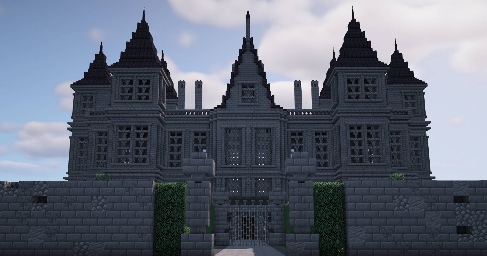

<video 
  src="images/cinematic-2.mov" 
  poster="images/hogwarts_air.jpg"
  controls 
  playsinline 
  style="width: 100%; aspect-ratio: 18/9; object-fit: cover; display: block; margin: 1rem auto; border-radius: 12px; overflow: hidden;">
</video>

## About the project

Since March 2019, I have been recreating Hogwarts Castle from *Harry Potter* in Minecraft. The project combines research into the castle’s architectural design with detailed reconstruction and interior accuracy.

Command blocks, data packs, and custom textures and models help bring the castle to life.

Alongside Hogwarts, I have built the Ministry of Magic, Azkaban, Malfoy Manor, and the Burrow.

I documented this journey on YouTube, where my channel has grown to over 38,000 subscribers and 7.5 million views. I have also produced a 34-episode tutorial series guiding viewers through the castle’s construction.

## The Castle

  

    <figure class="carousel-slide">
      
    </figure>
    <figure class="carousel-slide">
      
    </figure>
    <figure class="carousel-slide">
      
    </figure>
    <figure class="carousel-slide">
      
    </figure>
  

  <button class="prev" aria-label="Previous">&#10094;</button>
  <button class="next" aria-label="Next">&#10095;</button>

### Magic

The castle wouldn't be magical without movement. 
*The stairs also rotate...*

<video 
  src="images/chessbattlescene.mp4" 
  poster="images/hogwarts_chess1.jpg"
  controls 
  playsinline 
  style="width: 100%; aspect-ratio: 18/9; object-fit: cover; display: block; margin: 1rem auto; border-radius: 12px; overflow: hidden;">
</video>

<video 
  src="images/chamber_silent.mp4" 
  controls 
  playsinline 
  muted
  loop
  style="width: 100%; aspect-ratio: 18/9; object-fit: cover; display: block; margin: 1rem auto; border-radius: 12px; overflow: hidden;">
</video>

### Custom Textures and Models

50+ custom models and textures bring the magic of the castle to life and break the boundaries of classical Minecraft. All made by me!

  

    <figure class="carousel-slide">
      
    </figure>
    <figure class="carousel-slide">
      
    </figure>
    <figure class="carousel-slide">
      
    </figure>
    <figure class="carousel-slide">
      
    </figure>
  

  <button class="prev" aria-label="Previous">&#10094;</button>
  <button class="next" aria-label="Next">&#10095;</button>

## The Wizarding World

### Ministry of Magic

<figure style="position: relative; display: inline-block; margin: 0; border-radius: 12px; overflow: hidden;">
  
</figure>

### Azkaban

<figure style="position: relative; display: inline-block; margin: 0; border-radius: 12px; overflow: hidden;">
  
</figure>

### The Burrow

<figure style="position: relative; display: inline-block; margin: 0; border-radius: 12px; overflow: hidden;">
  
</figure>

### Malfoy Manor

<figure style="position: relative; display: inline-block; margin: 0; border-radius: 12px; overflow: hidden;">
  
</figure>

<!-- Styles and JS  -->

