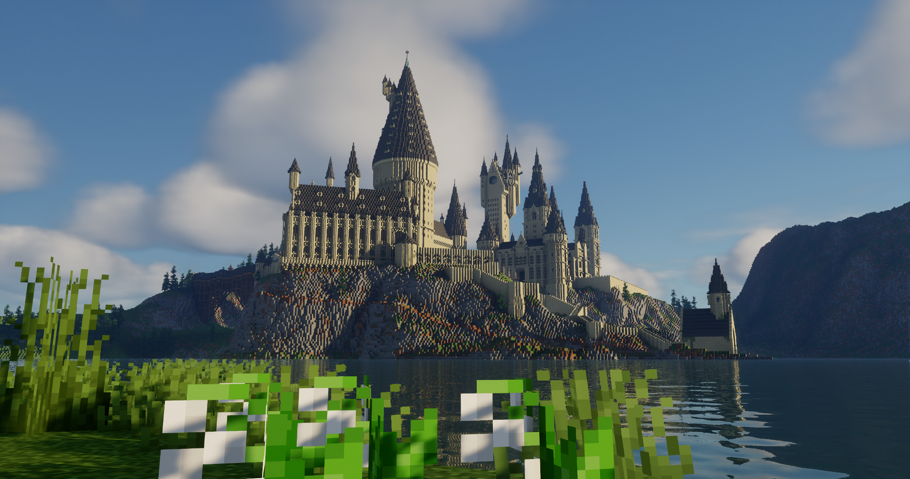

<figure style="position: relative; display: inline-block; margin: 0;">
  
  <figcaption style="
    position: absolute;
    bottom: 0;
    left: 50%;
    transform: translateX(-50%);
    background: rgba(0, 0, 0, 0.5);
    color: white;
    padding: 4px 8px;
    font-size: inherit;
    font-weight: normal;
    text-align: center;
    width: 100%;
  ">
    Minecraft Hogwarts
  </figcaption>
</figure>

## About the project

I have been recreating Hogwarts Castle from Harry Potter in Minecraft since March 2019. This project has involved researching the castle's architectural designs, recreating the castle in Minecraft, and populating the interior to be as accurate as possible.

Command blocks, data packs, and custom textures and models bring the magic of the castle to life.

In addition to the castle, I have built the Ministry of Magic, Azkaban, Malfoy Manor, and The Burrow.

I have documented my building journey on YouTube, amassing over 38,000 subscribers and 7.5 million views. I have also created a building tutorial for the castle, consisting of 34 detailed episodes for viewers to follow along.

## The Castle

## Magic

## Custom Textures and Models

