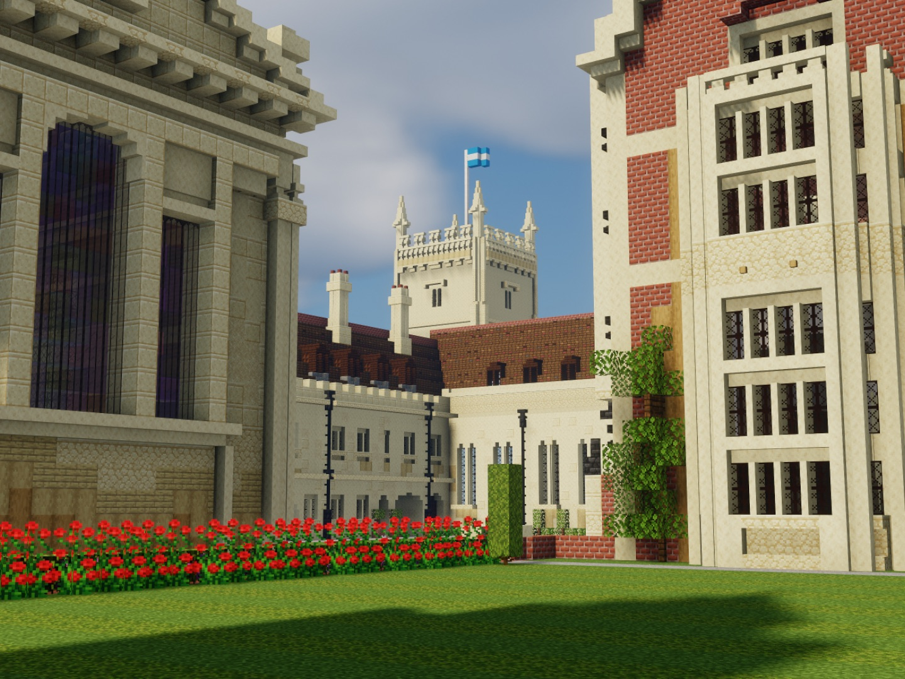
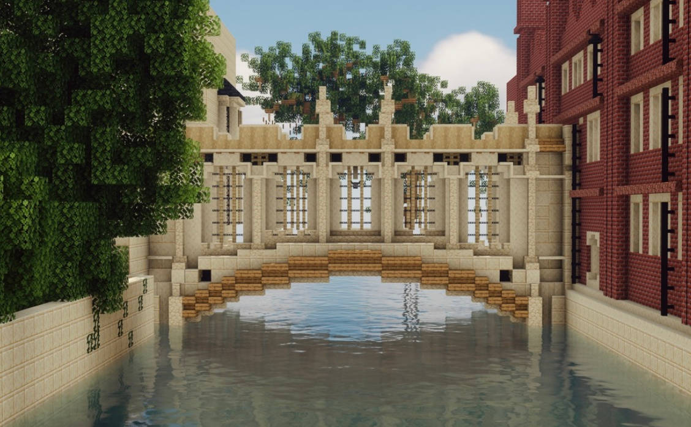

<figure style="position: relative; display: inline-block; margin: 0; border-radius: 12px; overflow: hidden;">
  
</figure>

## About the project

I've always enjoyed recreating the world around me in Minecraft. Cambridge is simply begging to be Minecraft-ified. What started as a small project of recreating my college, Pembroke, over the winter vacation, quickly became a project of recreating as much of the city as possible. Check out my Instagram page ([@cambridgeinminecraft](https://www.instagram.com/cambridgeinminecraft/)).

## Colleges

> [Pembroke College](#pembroke)  
> [St John's College](#st-johns)  

### Pembroke

  

    <figure class="carousel-slide">
      
      <figcaption class="carousel-caption">Old Court</figcaption>
    </figure>
    <figure class="carousel-slide">
      
      <figcaption class="carousel-caption">Bowling Green and New Court</figcaption>
    </figure>
    <figure class="carousel-slide">
      
      <figcaption class="carousel-caption">Library Lawn and Old Court</figcaption>
    </figure>
    <figure class="carousel-slide">
      
      <figcaption class="carousel-caption">Foundress Court</figcaption>
    </figure>
  

  <button class="prev" aria-label="Previous">&#10094;</button>
  <button class="next" aria-label="Next">&#10095;</button>

### St John's

  

    <figure class="carousel-slide">
      
      <figcaption class="carousel-caption">New Court</figcaption>
    </figure>
    <figure class="carousel-slide">
      
      <figcaption class="carousel-caption">Bridge of Sighs</figcaption>
    </figure>
    <figure class="carousel-slide">
      
      <figcaption class="carousel-caption">St John's Chapel</figcaption>
    </figure>
  

  <button class="prev" aria-label="Previous">&#10094;</button>
  <button class="next" aria-label="Next">&#10095;</button>

