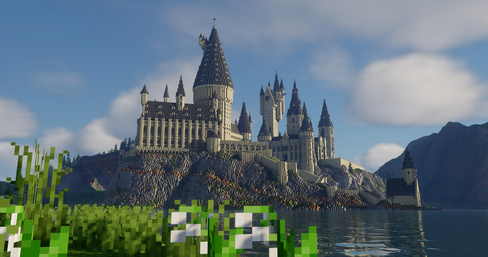
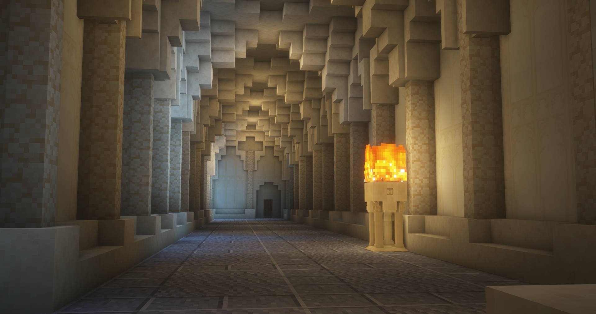
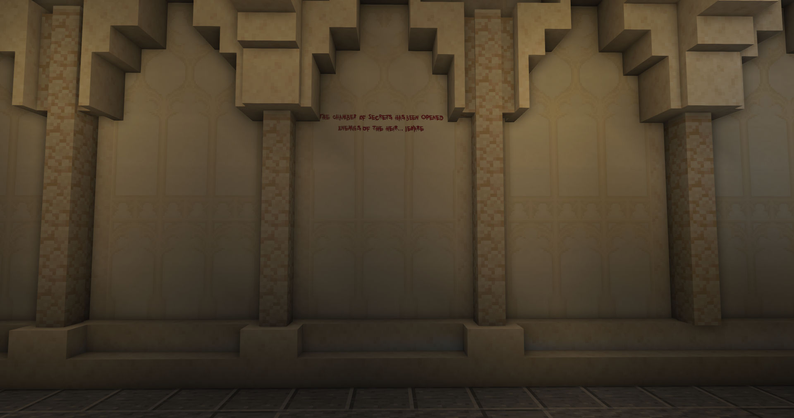
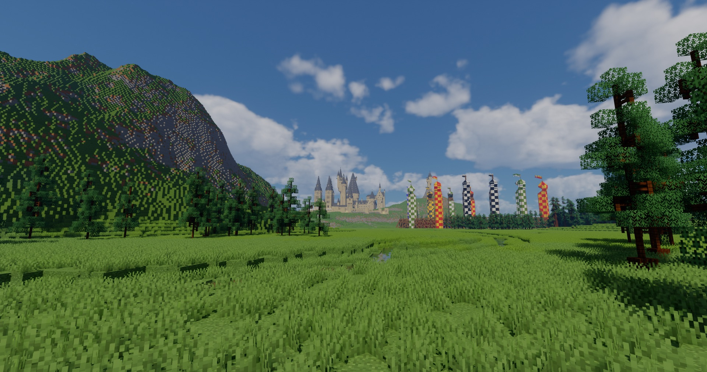
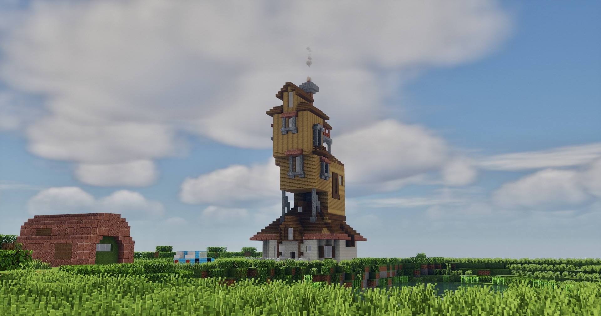
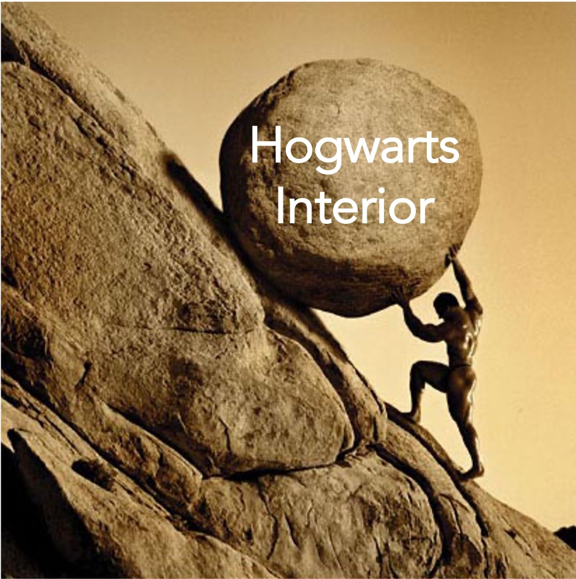

  <!-- ── HERO ─────────────────────────────────────────── -->
  <section class="hw-hero">
    

      <!-- <video autoplay muted loop playsinline poster="images/hogwarts_air.jpg"> -->
      <video autoplay muted loop playsinline>
        <source src="images/cinematic.mp4" type="video/mp4">
      </video>
    

    

      <!-- 
A Minecraft Recreation
 -->
      <h1 class="hw-hero-title pd-reveal">Hogwarts Castle and Grounds</h1>
      <!-- 
Research, rebuilding, and a slightly unreasonable amount of floor planning.
 -->
      
Research, rebuilding, and a slightly unreasonable amount of floor planning.

    

    
↓

  </section>

  <!-- ── STATS ─────────────────────────────────────────── -->
  <!-- <section class="hw-stats">
    

      14M+
      Blocks
    

    

      6+
      Years in the making
    

    

      2,000
      Hours
    

    

      8M+
      YouTube views
    

  </section> -->

  <!-- ── ESTABLISHING SHOT ─────────────────────────────── -->
  <section class="hw-establish">
    <!-- <figure class="hw-full-img pd-reveal">
      
    </figure> -->
    

      <h2>The project I always come back to</h2>
      
I never really set out to spend years building Hogwarts. It started more simply: I loved the castle, I loved Minecraft. What began as a fun build quickly turned into something much deeper. The more I worked on it, the more I found myself researching tiny architectural details and rebuilding sections I thought I’d finished after new reference material became available.

       
      
I documented this journey on YouTube, where my channel has grown to over 40,000 subscribers and 8 million views. I have also produced a 34-episode tutorial series guiding viewers through the castle’s construction.

    

  </section>

  <!-- ── TOUR VIDEO ─────────────────────────────────────── -->
  <section class="hw-tour">
    

      <!-- 
Watch

      <h2 class="hw-tour-heading">The full castle tour</h2> -->
      

        <button class="hw-tour-facade" type="button" data-video-id="tlsSnm1L6w4" aria-label="Play the Hogwarts castle tour video">
          
          
            <svg viewBox="0 0 68 48">
              <path class="hw-tour-play-bg" d="M66.5 7.7c-.8-2.9-2.5-5.4-5.4-6.2C55.8.1 34 0 34 0S12.2.1 6.9 1.5c-2.9.8-4.6 3.3-5.4 6.2C.1 13 0 24 0 24s.1 11 1.5 16.3c.8 2.9 2.5 5.4 5.4 6.2C12.2 47.9 34 48 34 48s21.8-.1 27.1-1.5c2.9-.8 4.6-3.3 5.4-6.2C67.9 35 68 24 68 24s-.1-11-1.5-16.3z"></path>
              <path d="M45 24 27 14v20z" fill="#fff"></path>
            </svg>
          
        </button>
      

    

  </section>

  <!-- ── INTERIOR ───────────────────────────────────────── -->
  <section class="hw-establish">
    <figure class="hw-full-img pd-reveal">
      
    </figure>
    

      <h2>The Interior</i> </h2>
      
Any Minecraft builder would agree with me - interior SUCKS. Making a coherent interior which doesn't appear like a maze is no easy task, especially given the lack of reference material and that the films were clearly filmed in a non-Euclidean space to get everything to connect.<button class="hw-footnote-ref" id="hw-footnote-ref-1" type="button" data-footnote-target="hw-footnote-1" aria-label="Open footnote 1">[1]</button>

       
      
I put my digital art skills to the test and made a custom resource pack with 50+ custom models and textures to bring the castle to life. Command blocks then make it move. Namely, the opening of the Chamber of Secrets, Dumbledore's Office, and a working Wizard's Chess battle:

    

  </section>

  <!-- ── WIZARD'S CHESS ─────────────────────────────────── -->
  <section class="hw-tour">
    

      <!-- 
The Magic

      <h2 class="hw-tour-heading">Wizard's Chess</h2> -->
      

        <button class="hw-tour-facade" type="button" data-video-id="v96zMf2Cmlc" aria-label="Play the Wizard's Chess video">
          
          
            <svg viewBox="0 0 68 48">
              <path class="hw-tour-play-bg" d="M66.5 7.7c-.8-2.9-2.5-5.4-5.4-6.2C55.8.1 34 0 34 0S12.2.1 6.9 1.5c-2.9.8-4.6 3.3-5.4 6.2C.1 13 0 24 0 24s.1 11 1.5 16.3c.8 2.9 2.5 5.4 5.4 6.2C12.2 47.9 34 48 34 48s21.8-.1 27.1-1.5c2.9-.8 4.6-3.3 5.4-6.2C67.9 35 68 24 68 24s-.1-11-1.5-16.3z"></path>
              <path d="M45 24 27 14v20z" fill="#fff"></path>
            </svg>
          
        </button>
      

    

  </section>
  <!-- <section class="hw-interior">
    
Gallery

    

      <figure class="hw-int-main pd-reveal">
        
        <figcaption>The Cloisters</figcaption>
      </figure>
      <figure class="hw-int-side pd-reveal">
        
        <figcaption>Interior Detail</figcaption>
      </figure>
      <figure class="hw-int-side pd-reveal">
        
        <figcaption>Courtyard Detail</figcaption>
      </figure>
    

  </section> -->

  <!-- ── CHAMBER VIDEO ─────────────────────────────────── -->
  <!-- <section class="hw-video-section">
    <video autoplay muted loop playsinline class="hw-video-bg">
      <source src="images/chamber_silent.mp4" type="video/mp4">
    </video>
    

      <h2>The Chamber of Secrets.</h2>
      
Command blocks bring the magic to life

    

  </section> -->

  <!-- ── CHESS VIDEO ───────────────────────────────────── -->
  <!-- <section class="hw-video-section hw-chess-section">
    <video autoplay muted loop playsinline class="hw-video-bg">
      <source src="images/chessbattlescene.mp4" type="video/mp4">
    </video>
    

      <h2>Wizard's Chess</h2>
    

  </section> -->

  <!-- ── THE GROUNDS ───────────────────────────────────── -->
  <!-- <section class="hw-grounds">
    

      <h2>The grounds</h2>
      
It's called Hogwarts Castle <i> and grounds</i>, afterall. Set in the mountains of Scotland, the grounds include the Quidditch Pitch, Hagrid's Hut, the Forbidden Forest, the Whomping Willow, the Great Lake (3 blocks deep - pre 1.18 sucks), Hogsmeade Station, and the Glenfinnan Viaduct. The terrain was largely built using World Edit and World Painter. Closer to the castle, the terrain was built by hand (I clearly hate myself).

      
Gallery

    

    

      <figure class="hw-grounds-main pd-reveal">
        
        <figcaption>The Quidditch Pitch</figcaption>
      </figure>
      <figure class="hw-grounds-sm pd-reveal">
        
        <figcaption>Buckbeak's River</figcaption>
      </figure>
      <figure class="hw-grounds-sm pd-reveal">
        
        <figcaption>The Forbidden Forest</figcaption>
      </figure>
    

  </section> -->

  <!-- ── THE WIDER WORLD ───────────────────────────────── -->
  <!-- <section class="hw-world">
    

      <h2>The wizarding world</h2>
      
Because building Hogwarts wasn't enough, I've also built various other locations from the Wizarding World. Unfortunately, these aren't (yet) combined into one larger world to explore.

    

    

      <figure class="hw-world-img pd-reveal">
        
        <figcaption>The Burrow</figcaption>
      </figure>
      <figure class="hw-world-img pd-reveal">
        
        <figcaption>Malfoy Manor</figcaption>
      </figure>
      <figure class="hw-world-img pd-reveal">
        
        <figcaption>Ministry of Magic</figcaption>
      </figure>
      <figure class="hw-world-img pd-reveal">
        
        <figcaption>Azkaban</figcaption>
      </figure>
    

  </section> -->

  <!-- ══════════════════════════════════════════
      FLOOR MAP — interactive multi-floor explorer
      ─────────────────────────────────────────
      All editable data (floors, locations, images, text)
      lives in HW_FLOORS at the bottom of this file.

      Maps: images/floorplan-{grounds,0,1,...}.png (2508 × 1576 px)
      Marker coords stored as % of the map's native dimensions.
      Clicking a marker shows an info panel overlaid on the map.
══════════════════════════════════════════ -->
  <section class="hw-map-section pd-reveal">
    

      <h2 class="hw-map-heading">Explore the castle</h2>
      <!-- 
Select a floor, then click a location.
 -->

  <!-- Floor tabs — injected by JS -->
  

  

    <!-- ★ Map + marker overlay -->
    

      

        
      

      

    

  <!-- ★ Info panel — overlays map left side (desktop) / stacks below (mobile)
        Update content via HW_FLOORS location fields: image, desc, history -->
  

    

      
    

    

      <h3 id="hw-panel-name" class="hw-panel-name"></h3>
      

      

        
History <svg class="hw-panel-chevron" viewBox="0 0 10 6" fill="none" xmlns="http://www.w3.org/2000/svg"><path d="M1 1l4 4 4-4" stroke="currentColor" stroke-width="1.5" stroke-linecap="round" stroke-linejoin="round"/></svg>

        

          

        

      

    

  

  

  </section>

  <!-- ── TIMELINE ──────────────────────────────────────── -->
  

    
The Journey

  

  <section class="pd-timeline-shell">
    

      <article class="pd-timeline-item pd-reveal">
        
February 2019

        

        

          
          <h2>Episode 1 of Building Hogwarts is released</h2>
        

      </article>
      <article class="pd-timeline-item pd-reveal">
        
July 2019

        

        

          
          <h2>After a break, work resumes on the East Wing. I also release my Discord server and my community starts to grow.</h2>
        

      </article>
      <article class="pd-timeline-item pd-reveal">
        
September 2019

        

        

          
          <h2>The East Wing is re-worked to improve its accuracy. I commit to trying to release weekly episodes of my Let's Build series.</h2>
        

      </article>
      <article class="pd-timeline-item pd-reveal">
        
October 2019

        

        

          
          <h2>The Astronomy Tower is added. Its design will be updated many times.</h2>
        

      </article>
      <article class="pd-timeline-item pd-reveal">
        
December 2019

        

        

          
          <h2>Work on the Grand Staircase Tower and Great Hall begins. It's really starting to look like Hogwarts!</h2>
        

      </article>
      <article class="pd-timeline-item pd-reveal">
        
February 2020

        

        

          
          <h2>The Prisoner of Azkaban castle extension is added, as well as the surrounding landscape.</h2>
        

      </article>
      <article class="pd-timeline-item pd-reveal">
        
April 2020

        

        

          
          <h2>Some major re-work on the East Wing - don't build Minecraft towers an even number of blocks wide! The Viaduct Entrance, Central Tower, and Bell Towers are all re-designed.</h2>
        

      </article>
      <article class="pd-timeline-item pd-reveal">
        
May 2020

        

        

          
          <h2>The Great Hall is re-designed and pushed backwards to allow for a more accurate viaduct angle.</h2>
        

      </article>
      <article class="pd-timeline-item pd-reveal">
        
July 2020

        

        

          
          <h2>The Great Lake and Scottish mountains are built using World Painter - I learn how to render Minecraft builds (crudely) in Blender.</h2>
        

      </article>
      <article class="pd-timeline-item pd-reveal">
        
August 2020

        

        

          
          <h2>The Transfiguration Courtyard is re-designed to be more accurate to Durham Cathedral. The Bell Towers are also re-designed.</h2>
        

      </article>
      <article class="pd-timeline-item pd-reveal">
        
October 2020

        

        

          
          <h2>Every roof is rebuilt at a steeper angle (PoA style). The Boat House is also updated to the HBP design rather than DH2.</h2>
        

      </article>
      <article class="pd-timeline-item pd-reveal">
        
April 2021

        

        

          
          <h2>The landscape is majorly overhauled by hand to be more true to the Half Blood Prince model. The Boat House Staircase is also re-built in line with the new landscape.</h2>
        

      </article>
      <article class="pd-timeline-item pd-reveal">
        
April 2022

        

        

          
          <h2>Custom window models are implemented to improve accuracy and maximise interior space.</h2>
        

      </article>
      <article class="pd-timeline-item pd-reveal">
        
August 2023

        

        

          
          <h2>The Glenfinnan Viaduct and Hogsmeade Station are added into the surrounding landscape.</h2>
        

      </article>
    

    <!-- 

      
To be continued...

    
 -->
  </section>

 

  <section class="hw-endnotes" aria-label="Footnotes">
    

      

        [1]
        

          

            
Me trying to make Hogwarts interiors connect

            <button class="hw-footnote-back" type="button" data-footnote-back="hw-footnote-ref-1" aria-label="Return to footnote reference">
              ↩
            </button>
          

          
        

      

    

  </section>

<!-- ── Hogwarts floor map ──────────────────────────────────────

  ★ EDIT HW_FLOORS below to maintain the map:

  Per location:
    label   — name shown in the marker tooltip and panel header
    x / y   — position as % of map image (2508 × 1576 px native)
                formula: x = pixel_x / 2508 * 100
    image     — path to a single image, e.g. "images/my-photo.jpg"
                  leave "" if no image yet
    desc      — one or two sentences shown in the panel
    firstSeen — movie code where this location first appeared, e.g. "PS"
    updatedIn — array of movie codes where it was updated, e.g. ["CoS","PoA"]
                  valid codes: PS · CoS · PoA · GoF · OotP · HBP · DH1 · DH2
    history   — longer text shown under the collapsible "History" toggle
                  leave "" to omit; the toggle is hidden when all three
                  (firstSeen, updatedIn, history) are empty

  Per floor:
    label   — tab button text
    map     — path to the floor plan image

  Pixel-to-percent reference (map native: 2508 × 1576 px):
    Great Lake  267, 360  →  10.65%, 22.84%
────────────────────────────────────────────────────────────── -->

