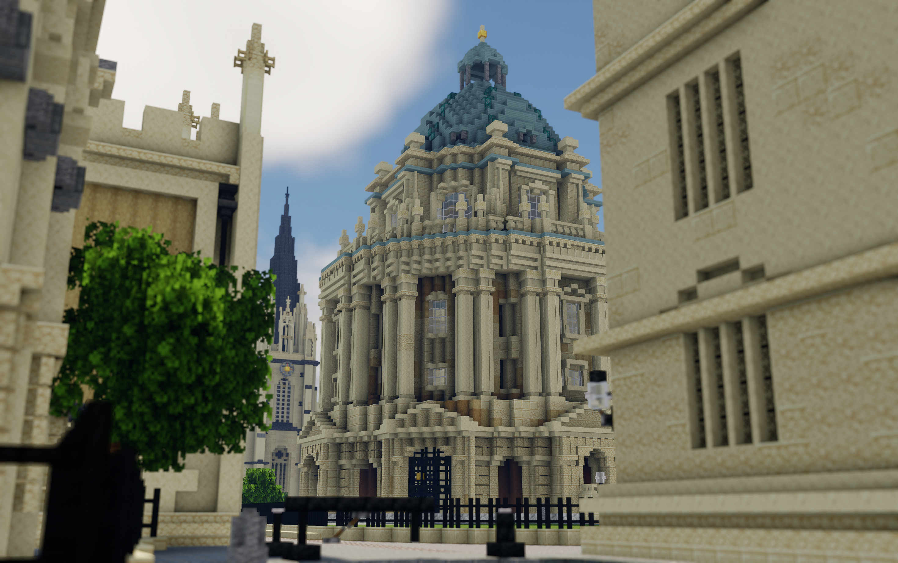
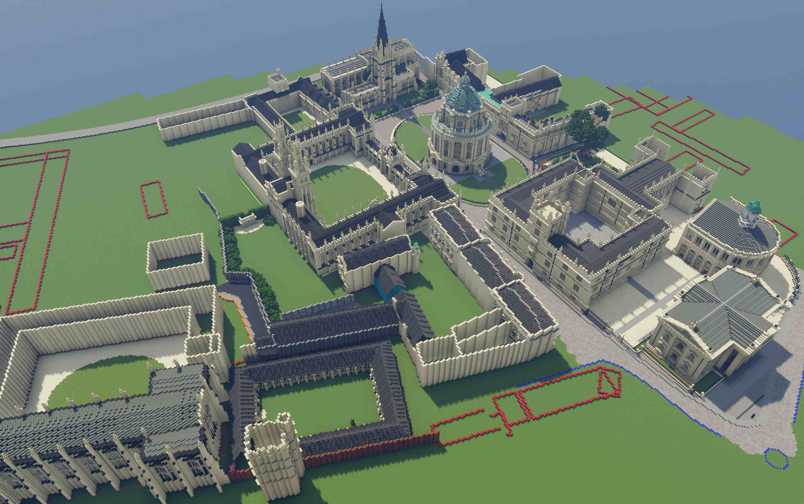
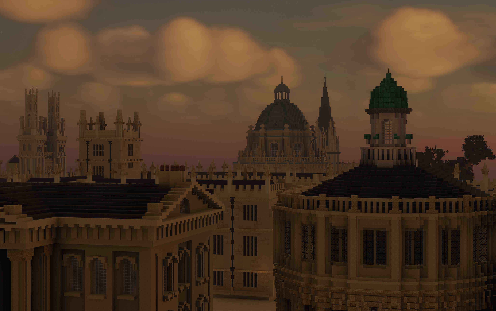
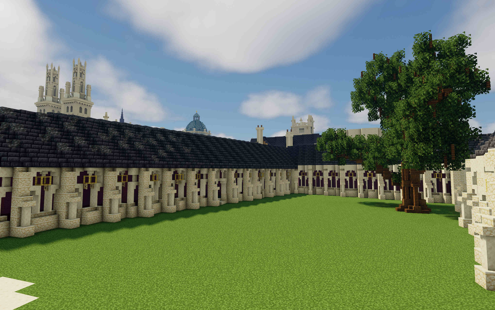

<figure style="position: relative; display: inline-block; margin: 0; border-radius: 12px; overflow: hidden;">
  
</figure>

## We built [Cambridge](/interests/minecraftcambridge). Let's build Oxford...

Except this time, rather than lots of individual colleges scattered about, I want that *City of Dreaming Spires* aesthetic — which meant building the entire city centre (and doing a lot of advanced planning)

I kept the same scale as Cambridge — 1:1.7 — and began meticulously laying out the area around the Radcliffe Camera. To make sure all the angles were correct, I vibe-coded a GIS program to import Google Earth imagery and draw polygons, which were then translated into Minecraft coordinates.

<figure style="position: relative; display: inline-block; margin: 0; border-radius: 12px; overflow: hidden;">
  
</figure>

<i>Oxford City Centre layout</i>

Oxford even reposted me on Instagram! @Cambridge take notes.

<figure style="position: relative; display: inline-block; margin: 0; border-radius: 12px; overflow: hidden;">
  
</figure>

Ironically, New College was used as the Transfiguration Courtyard in *Harry Potter and the Goblet of Fire*. So, once again, I’m building Hogwarts in Minecraft — only this time at an angle (a throwback to my first ever Hogwarts build).

<figure style="position: relative; display: inline-block; margin: 0; border-radius: 12px; overflow: hidden;">
  
</figure>

<i>Everything leads back to Hogwarts...</i>

*Still building...*