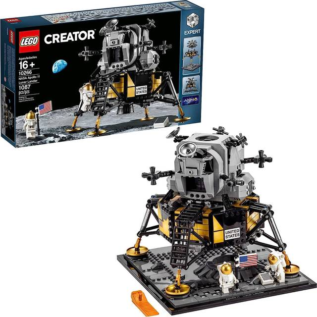

I recently acquired the Lego NASA Apollo 11 Lunar Lander (10266) which made a fine addition to my space collection, joining the Apollo 11 Saturn V, Space Shuttle Discovery, Hubble Space Telescope, International Space Station, and Lego's own Space Shuttle Adventure.

<figure style="position: relative; display: inline-block; margin: 0; border-radius: 12px; overflow: hidden;">
  
</figure>

Having previously enjoyed film making with Lego, I wished to film a moon landing sequence with my new moon lander. As those who have made any short film will know, the audio and music can make or break a sequence. I am no audio/music expert, and therefore I turned to the film, First Man, to provide suitable audio and music, as well as scene direction.

<video 
  src="images/full.mp4" 
  controls 
  playsinline 
  style="width: 100%; aspect-ratio: 18/9; object-fit: cover; display: block; margin: 1rem auto; border-radius: 12px; overflow: hidden;">
</video>