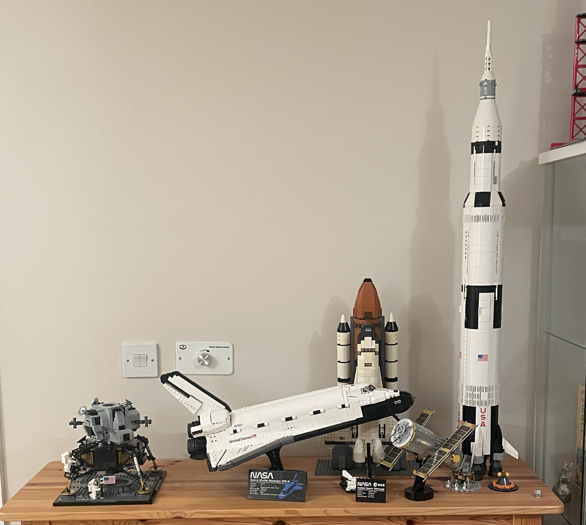
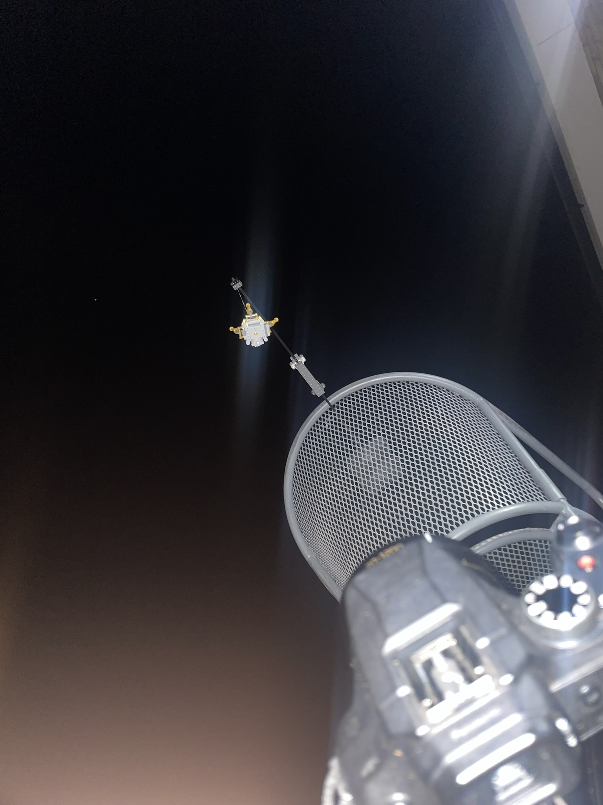
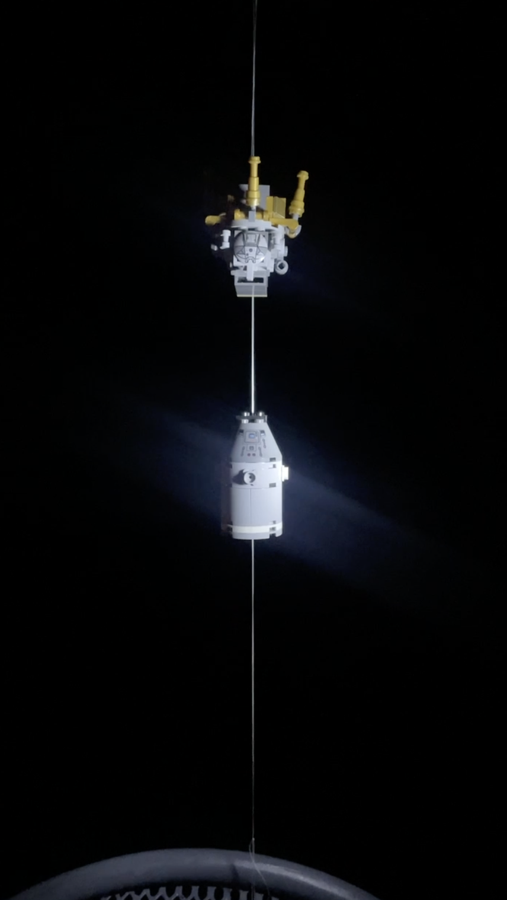
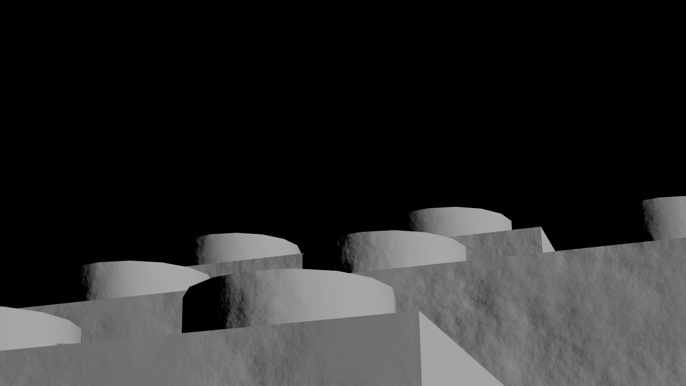
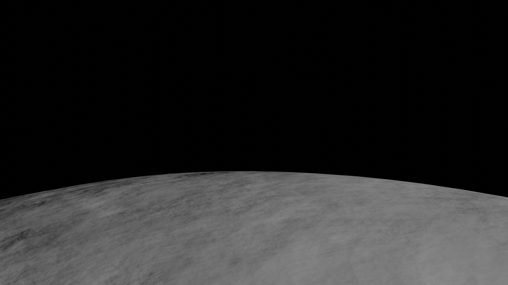
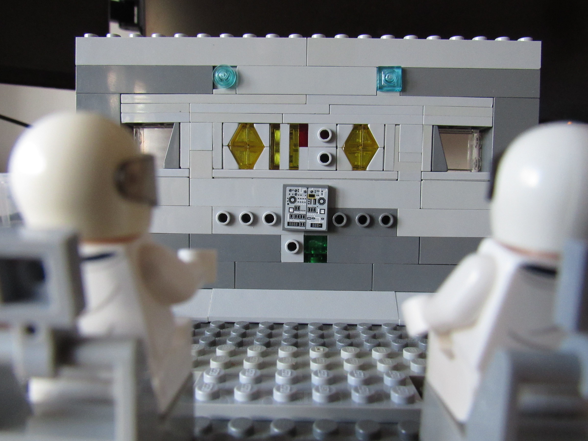
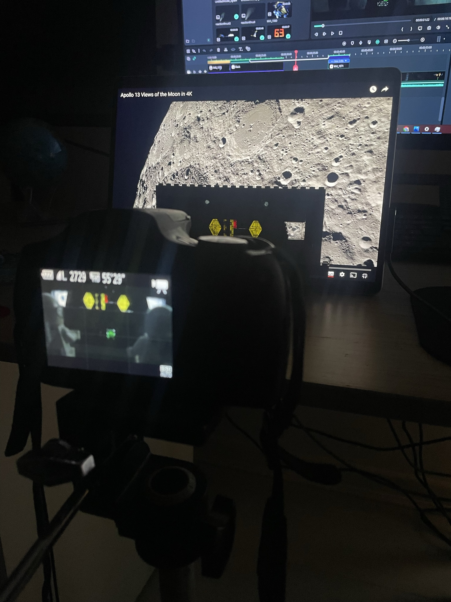
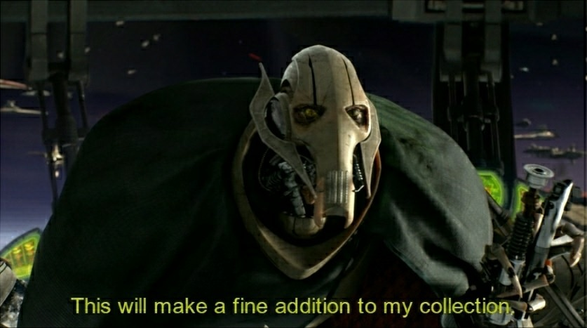

I recently acquired the Lego NASA Apollo 11 Lunar Lander which made a fine addition to my space collection[^1], joining the Apollo 11 Saturn V, Space Shuttle Discovery, Hubble Space Telescope, International Space Station, and Lego's own Space Shuttle Expendition.

<figure style="position: relative; display: block; margin: 0 auto; text-align: center; border-radius: 12px; overflow: hidden;">
  
</figure>

Having previously enjoyed filmmaking with Lego, I wished to film a moon landing sequence with my new moon lander. As those who have made any short film will know, the audio and music can make or break a sequence. I am no audio/music expert, and therefore I turned to the film, First Man, to provide suitable audio and music, as well as scene direction.

## Practical Shots and Sets

 I needed shots that actually looked convincing in camera. So I tried to do as much as possible practically, using suspended Lego models, simple set builds, and a lot of improvised lighting and perspective tricks. It was a very low-budget setup, but it gave the sequence a much more believable feel.

<figure style="position: relative; display: block; margin: 0 auto; text-align: center; border-radius: 12px; overflow: hidden;">
  
</figure>

<figure style="position: relative; display: block; margin: 0 auto; text-align: center; border-radius: 12px; overflow: hidden;">
  
</figure>

<i>Mini Lego builds dangling from dental floss and a DIY pulley system to re-create stage separation</i>

I next needed a moon...

Turns out faking a moon is incredibly difficult[Citation needed]. I first considered a miniature moon build which I could then stitch with the shots of the lander and command module. I faced two issues here. I didn't have enough parts to build a convincingly cratered surface. And secondly, I didn’t have a camera with a long enough focal length to make the Lego look convincingly large. 

Let's build a digital moon.

I tried two versions. A Lego moon and a 'real' moon.

A Lego moon has issues. 1) it looks a bit stupid. 2) Lego studs create shadows making the studs look like massive mountains. And in space, where there is no atmosphere to scatter light, shadows are effectively pitch black. This looks really weird.

I decided to use a 'real' moon and designed one in Blender - it wasn't great and present me wishes I did a better job of it. But it did the job. 

<figure style="display: flex; justify-content: center; gap: 10px; margin: 0 auto; text-align: center;">
  
  
</figure>

<i>Lego and 'real' moon</i>

Next I needed a lunar lander interior set. Easy enough, just build it out of Lego and use force perspective to make it look smaller relative to the minifigures. I left holes behind all the panels so that I could light them up from behind. And how to add the background of the moon out of the windows? Use my fake moon or just real moon footage and play these on my laptop - simple enough.

<figure style="display: flex; justify-content: center; gap: 10px; margin: 0 auto; text-align: center;">
  
  
</figure>

And with that, we had the intro sequence:

<video 
  src="videos/beginning.mp4" 
  controls 
  playsinline 
  style="width: 100%; aspect-ratio: 18/9; object-fit: cover; display: block; margin: 1rem auto; border-radius: 12px; overflow: hidden;">
</video>

[^1]: A fine addition indeed. 