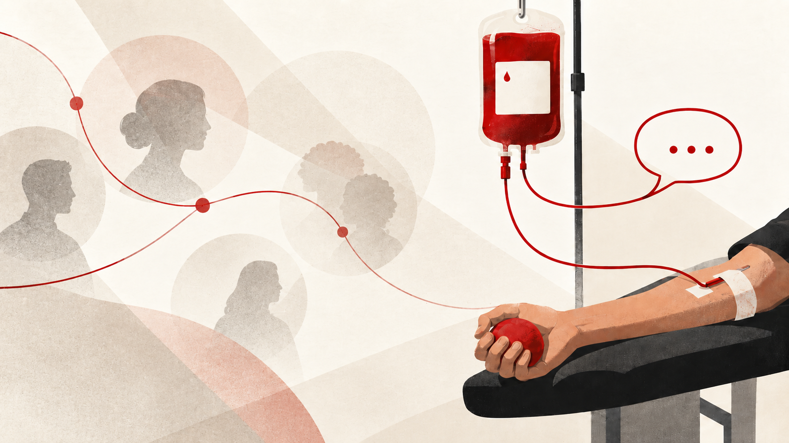

<figure style="position: relative; display: block; margin: 0 auto; text-align: center; border-radius: 12px; overflow: hidden;">
  
</figure>

I donate blood as frequently as possible.

You should too, if you can.

But I think you should do something else as well: tell people about it!

There is a slightly odd social norm that doing good things is admirable, but that you shouldn't talk about it. Donate blood quietly. Give money anonymously. Change your behaviour for ethical reasons, but don't make a thing of it.

Otherwise, it's branded as performative altruism or virtue signalling.

And to be clear, I don't particularly like virtue signalling. If the point of talking about a good action is primarily to make yourself look like a good person — especially if the signalling substitutes for actually doing anything — then I think the criticism is fair.

But I think we've overcorrected.

A lot of our behaviour is socially contagious. Things feel more normal when people around us do them. If none of your friends ever talks about donating blood, donating money, becoming vegan, or volunteering, those behaviours can remain strangely abstract — they are things that *some* people do.

Then someone you know does it.

Then another.

Suddenly it feels ordinary.

This is one reason I think there can be genuine value in talking publicly about prosocial choices. Not because everyone needs applause for doing something good, but because visibility changes norms[^1].

Someone might already be sympathetic to an idea without ever really encountering it, or without ever being pushed to think seriously about what it implies for their own behaviour. Making your actions visible gives them that opportunity.

They discover the idea. They confront their own beliefs. And sometimes they change what they do.

A belief kept entirely private cannot become a social norm.

The opposite is true too.

When bad behaviour is normal and visible, it becomes easier for other people to adopt it. Norms propagate in both directions.

So if you genuinely believe that something you're doing is good, I think there is value in being vocal about it — and encouraging other people to join in.

There is obviously a bad version of this.

If telling people becomes the point — if the act is mainly a prop for constructing an identity — something has gone wrong. And broadcasting every good thing you do would be unbearable.

But “never tell anyone” doesn't seem like the right rule either.

If a behaviour is good and we want more people to do it, there is value in making it visible.

So: if you're eligible, [sign up to give blood](https://www.blood.co.uk/the-donation-process/registering-online/).

And afterwards, tell someone.

If you want a behaviour to become normal, somebody has to be seen doing it.

---

*And if you feel like challenging a few more social norms: consider going vegan (it's good for the planet and animals), or giving[^2] some of your income to a charity you think does something genuinely useful. [Giving What We Can](https://www.givingwhatwecan.org/) is a good place to start.*

[^1]: This is partly the point of this post. Nothing here is new or revolutionary — it’s just here to make prosocial behaviour a little more visible

[^2]: This is logical OR, not XOR.