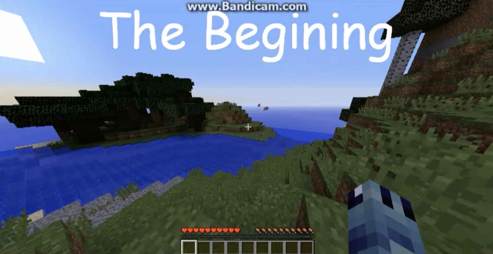
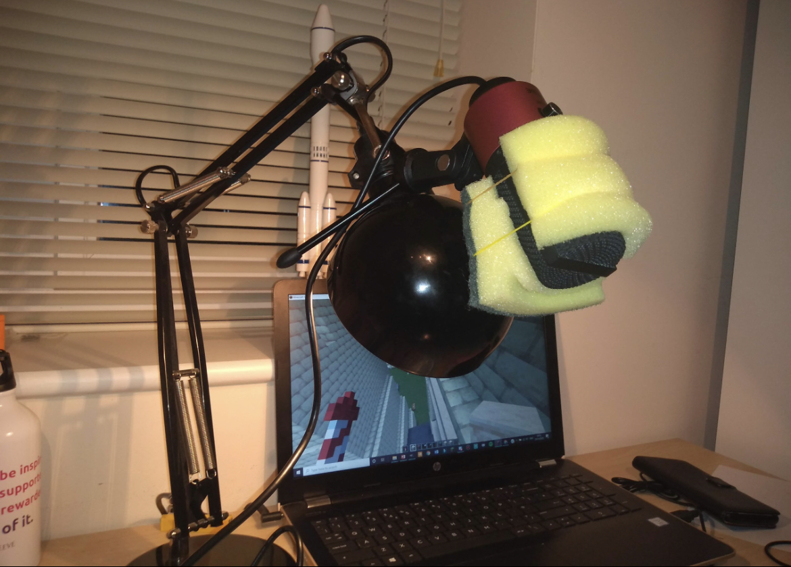
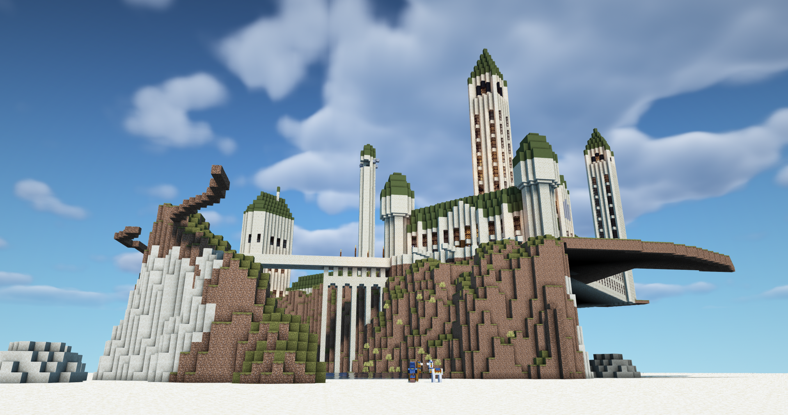
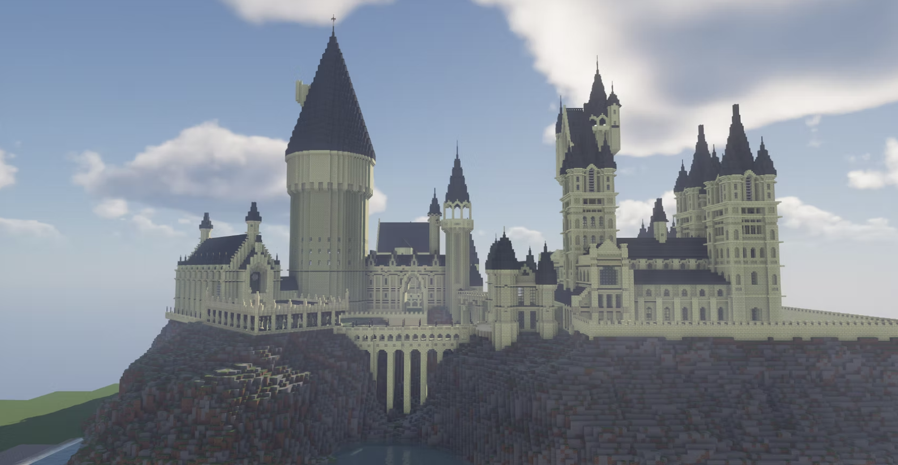
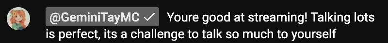

Having a Minecraft YouTube channel is, for many people, probably a fun (and slightly cringe) fact to tell in a game of two truths and one lie. 

I feel like my YouTube journey is less cringe. And, I will argue, was the greatest decision I ever made.

At the time, it just felt like playing Minecraft and uploading videos.
Looking back, it taught me skills that shaped almost everything I do today.

## First, story time.

My YouTube channel(s) began just like any of my peers' did: cringe gameplay narrated by a pre-pubescent child, overly loud intro music, 5 views, and 1 like (myself). You got 30, 40 subscribers, 100 if you were lucky (and active enough on sub4sub), and maybe a video with over a thousand views if you hit the algorithm[^1].

My first video was uploaded on the 14th February 2015[^2] — "Minecraft PC survival-{1} The Beginning". It was shit. My laptop couldn't record audio and my screen at the same time. I played Minecraft for 20 minutes, narrating it in my head. I then watched the video back and narrated what I could remember over the top. No edits. Raw Minecraft.

<figure style="position: relative; display: block; margin: 0 auto; text-align: center; border-radius: 12px; overflow: hidden;">
  
</figure>

<i>Episode 1. I couldn't even spell "Beginning" right</i>

I slowly improved at YouTube. I learnt how to edit videos, render 3D Minecraft objects, and create thumbnails. Despite uploading consistently for years, the channel went nowhere. But I didn’t care. I enjoyed making videos anyway.

Looking back, that taught me something important: effort alone doesn’t guarantee growth. Timing matters too. Luck matters.

But when luck finally came, I was ready.

Let's skip forward a few years to my main channel — for the sake of keeping this off Google search let's call it PD — where I was able to apply all that I had learnt and effectively hit the ground running. As a lifelong Harry Potter fan, I wished to build (and document) Hogwarts in Minecraft. 
Life then got busy (GCSEs) and I stopped after Episode 2[^3]. Whether through YouTube prowess or sheer luck, my first video reached 3,000 views — woah! Suddenly, I had some momentum. I can balance GCSEs and YouTube, surely?

Covid hit. Whether you view Covid as lucky or unlucky probably depends on your experience of it. Notwithstanding the huge amount of suffering caused by Covid, I had a fantastic lockdown. GCSEs? Cancelled. Minecraft YouTube? In full swing. The digital world was thriving. This is the luck that I was originally missing. But importantly, I was prepared for luck to strike. One of my dad's classic dad phrases is:

<!-- > "Luck favours the prepared mind"
>— Louis Pasteur (abbrev.) -->

<blockquote style="
  margin: 2rem auto;
  padding: 1.25rem 1.5rem;
  max-width: 700px;
  border-left: 4px solid #002a4f;
  background: rgba(255,255,255,0.03);
  border-radius: 8px;
  font-style: italic;
  line-height: 1.6;
">
  

    “Luck favours the prepared mind.”
  

  <footer style="
    margin-top: 0.75rem;
    text-align: right;
    font-size: 0.95rem;
    opacity: 0.75;
    font-style: normal;
  ">
    — Louis Pasteur (abbrev.)
  </footer>
</blockquote>

I was prepared. I had done the practice, struggled, been consistent, learnt how to YouTube. Luck could now favour me.

I started live streaming. Talking to yourself for hours at a time — and I mean genuinely to yourself when you have 0 viewers and such a high latency that even if you had 1 or 2, it was like having a conversation with someone on Mars — is a very difficult feat. And like anything, I started off being not very great at it[^4]. But after a lot of practice I got there! 

I hit 1,000 subscribers on May 10th 2020, 450 days after starting my channel. With 1,000 subscribers, YouTube lets you monetise your channel. I estimated that I would make around $5 a day from my adverts. I decided to invest in my YouTube channel and bought myself a fancyish (£20) microphone to replace my earphones which were dangled in front of me from my desk lamp and an actual video editing software. Goodbye Windows Live Moviemaker. 

Growing up, one of my friends always had the best setup — high-end PC, expensive microphone, premium software. I hated this. Probably because I was jealous — but also because I saw that it didn't lead to tangible results. It made me realise something: you don’t need the best equipment to make something good. You just need something that works.

I think this philosophy is best captured by my microphone setup. I had bought myself an actual microphone, but a pop-filter? Nah. I can cut up a kitchen sponge and still tape it to my desk lamp. Does the job perfectly fine.

<figure style="position: relative; display: block; margin: 0 auto; text-align: center; border-radius: 12px; overflow: hidden;">
  
</figure>

<i>Me and my setup against the world</i>

Second lockdown hit over Winter 2020-21. In January alone I went from 7,000 to 12,000 subscribers and earnt over £1,500 — a huge amount of money for a 16-year-old stuck at home. For the first time, I was financially independent. I didn’t need to ask my parents for anything.

I didn’t go crazy with it. I saved a good portion and spent the rest on things I actually valued — often small things, like buying coffee for friends or gifting them Discord Nitro (this was elite given we spent our lives on the app). It made me realise that I enjoyed using money to treat other people more than spending it on myself. 

At this time, one of my videos started exploding. Getting tens of thousands of views per day, peaking at 70,000 in a single day. It was exhilarating. I was refreshing my phone constantly, always screenshotting my live views page, watching the numbers climb.

But I was also aware that it wouldn't last forever.

And when it inevitably didn't, it was surprisingly difficult.

Especially when I would pour my time and energy into build videos and see them flop. But I think it's important to take a step back here and zoom out. My definition of 'flop' had changed. Recall that I was delighted that my first video reached 3,000 views. Now, 3,000 views seemed like failure. 

Success and failure are relative to what you’re used to. I've noticed this mindset carry over into other areas of my life — academics, sport, and beyond. I always have a tendency to want more, to feel like things could have been better, and sometimes kick myself for not doing better.

I'm not very good at appreciating what I've already done.

Up to this point, this might sound like a story about YouTube glory — views, subscribers, money, and growth.

But looking back, that's not really the interesting part.

The most valuable thing YouTube gave me wasn't any of those surface-level metrics. It was the set of skills I built, almost accidentally, by making videos for years.

And those have turned out to be far more important than the channel itself.

## What YouTube actually gave me

In hindsight, the most valuable thing YouTube gave me wasn't the money, or even the audience.

It was skills. Not in a formal, structured way, but through years of just making things, over and over again. 

Without realising it, I was training myself across a surprisingly wide range of skills. This is something I've struggled to communicate in my various (failed) job applications. Not because it isn't true, but because it doesn't fit neatly on a CV. "Minecraft YouTuber" doesn't exactly scream "transferable skills" even if in reality, it probably should[^5].

I learnt how to design material that was actually informative. I picked up video and photo editing along the way. My MS Powerpoint skills are insane.

I got comfortable talking aloud — filling silence, explaining what I was doing, and keeping some kind of energy going, even when no one was watching. Over time, I learnt to slow down and speak more clearly[^6]. Most importantly, I learnt to speak my thought process aloud. At first, it was just to keep viewers interested. But over time, I trained myself to translate abstract thoughts into English in real time.

Running a Discord server with over 3,000 active members taught me about leadership. People chatted constantly, took part in events, and expected things to run smoothly. Leading my moderator team, I wasn’t the funniest person around, and I didn’t get involved in all the banter — I wasn’t the kind of leader who won people over purely through charisma.

I had disagreements with people, and not every decision I made was popular. Some moderators left[^7]. But even in conflict, I found that people respected consistency, fairness, and competence. Over time, I learnt that being quietly good at what you do tends to earn respect.

Minecraft itself added another layer — constantly thinking in 3D allowed me to develop incredible visual skills — the Red Apple Test? My apple is 4k quality and I can do whatever I want to it.

And then there was coding. What started as a simple Discord bot turned into hours of debugging, searching forums, talking to people, and slowly learning how to think like a programmer. I wasn't just coding for the sake of it — I was coding to deliver features my community was asking for.

Across all of this, one skill sat underneath everything else: iteration.

Nothing I made was good the first time. But each video, each stream, (each Hogwarts,) each project was slightly better than the last. Over time, that compounds.

<figure style="display: flex; justify-content: center; gap: 7.5px; margin: 0 auto; text-align: center;">
  
  
 
</figure>

<i>Hogwarts through the ages - 2017, 2020, 2022</i>

## Why this actually matters

At the time, all of this felt disconnected. It just felt like making Minecraft videos.

But looking back now, it’s clear that it built a foundation I still rely on today. These skills aren’t confined to YouTube and they’ve carried over into everything else I do. I’ve used my web development skills in committees, and my design skills to create figures that communicate complex ideas more clearly. Coding feels natural because I’ve already spent years figuring things out from scratch. 

And I’m convinced that learning to think aloud, and explain ideas clearly and in real time,  played a part in getting me through my interviews at Cambridge and now Oxford.

The biggest place this shows up in my 'real life' is in my research. When faced with a difficult problem, my instinct isn’t to get stuck. Instead, it’s to zoom out, test, and refine.

I hit a bit of a crisis during my dissertation — my results weren't very promising. Yes, “no result” is still a result, but I wanted something I could actually be proud of.

So I zoomed out. I challenged the assumptions in the papers I’d been following and started rethinking the approach entirely.

I was a bit scared — I was taking a risk, proposing new ideas with very little supervisor input. What if this flopped?

But that’s exactly the kind of thinking that had worked for me before. Cambridge rewards that kind of approach — pushing beyond what’s already been done.

And this time, it paid off.

Research is iterative. It’s just retold as a clean, linear story at the end.

## Being a Minecraft YouTuber was the best decision.

So was starting a Minecraft YouTube channel really the best decision I ever made?

At the time, it didn’t feel like a decision at all. It was just something I enjoyed doing.

It started with talking to no one, uploading videos no one watched, and slowly getting better anyway.

But over time, it taught me how to figure things out from scratch — whether that was editing a video, debugging code at 2am, or trying to make something slightly better than the last thing I made.

Those skills didn’t stay on YouTube. They’re the reason I’m comfortable tackling difficult problems, the reason I can break down complex ideas and communicate them clearly, and the reason I don’t panic when something doesn’t work the first time.

They’re a big part of what got me here — and what I’ll take with me into my PhD and beyond.

I thought I was just making Minecraft videos.

I was actually building the foundation for everything that came next.

That’s why it was the best decision I ever made.

[^1]: Note, this was before the days of fried dopamine receptors and short-form content. Getting 1000+ views on a reel or short is a much easier feat. YouTube OGs recall their videos getting stuck at 301 views.
[^2]: It is, perhaps, ironic that my 'other half' began on Valentine's Day
[^3]: If you're familiar with the Minecraft Hogwarts community, this is a common ending.
[^4]: GeminiTay said I was actually pretty good during one of my first few streams. 
[^5]: I wonder how this will change in the future. Older people on hiring committees may not appreciate what it means. But as my generation becomes those on these committees, this may change. I for one, will certainly see someone in a good light if they've had the courage to persevere on the internet.
[^6]: I still speak very quickly and often stumble over my words. But I have vastly improved.
[^7]: There was a surprising amount of drama in the Minecraft Hogwarts community.

