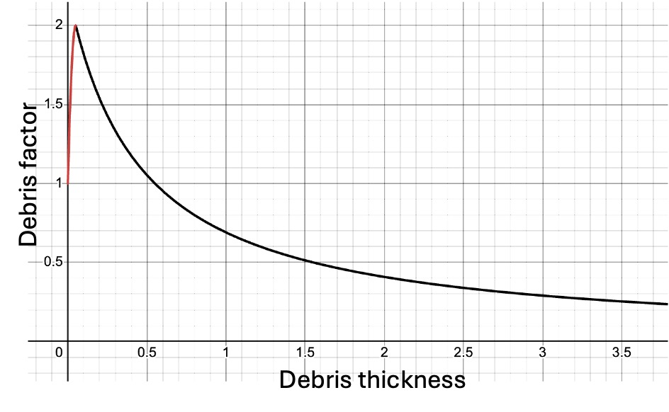

<!-- <figure style="position: relative; display: inline-block; margin: 0; border-radius: 12px; overflow: hidden;">
  
  <figcaption style="
    position: absolute;
    bottom: 0;
    left: 50%;
    transform: translateX(-50%);
    background: rgba(0, 0, 0, 0.5);
    color: white;
    padding: 4px 8px;
    font-size: 10px;
    font-weight: normal;
    text-align: center;
    width: 100%;
    border-bottom-left-radius: 12px;
    border-bottom-right-radius: 12px;
  ">
    Classified debris-covered glaciers in the Everest Region
  </figcaption>
</figure> -->

## Debris development

Debris-covered glaciers play an important role in high mountain environments, where layers of rock and sediment strongly influence how ice melts and evolves. Understanding how this debris develops is key for predicting glacier behaviour, meltwater supply, and long-term stability.

Here I present a simple two-dimensional MATLAB model designed to explore the main controls on debris development.

Let's define a 1D array, where each item represents a pixel of finite size (length $\Delta x$, width $\Delta y$). This array will store the volume of debris within each pixel. The debris thickness is simply:

<div align="center">
$H = \frac{V}{\Delta x \Delta y}$
</div>

The development of debris cover has two primary controls (<a href="#anderson2018">Anderson and Anderson, 2018</a>):

1. Velocity driven <br>
2. Meltout driven

### Velocity driven

Debris is moved down-glacier simply by ice flow. Thus, we must define the debris flux through each pixel boundary.

The volumetric debris flux through each boundary is:

<div align="center">
$Q = \Delta y HU,$
</div>

where $U$ is the ice surface velocity.

The change in debris volume inside pixel $i$ is therefore the flux intering through its up-glacier face minus the flux leaving its down-glacier face:

<div align="center">
$\frac{dV_i}{dt} = Q_{i - \frac{1}{2}} - Q_{i + \frac{1}{2}}$
</div>

Assuming the valley width remains constant in our model, it can be seen that when the glacier velocity is constant across regions, $dV/dt = 0$, and hence, there is no debris development.

Mountain glaciers typically decline in velocity monotonically toward the termius. Therefore, under such regimes, the debris flux into a given region is always greater than the flux out. Consequently, debris cover thickens down-glacier.

### Meltout driven

Debris also emerges from the meltout of englacial septa, which adds additional debris from velocity driven debris development. Therefore, we must define the volume of ice melted, which itself is a function of the overlying debris thickness, and the ratio of debris meltout to ice melt.

Debris attenuates the energy transfer from the atmosphere to the ice surface (<a href="#ostrem1959">Østrem, 1959</a>; <a href="#brock2010">Brock et al., 2010</a>). The melt rate at the ice surface increases as debris thickness increases until a critical thickness (known as the 'effective thickness'), $H_c$, is reached, which represents the maximum ablation rate, owing to the lower albedo of the debris surface compared to clean ice and snow (<a href="#ostrem1959">Østrem, 1959</a>). Beyond this threshold, the attenuation of thermal energy from the atmosphere through the debris negates the increased energy absorption at the surface by the darker debris, resulting in debris insulating the ice surface.

Let's represent this using a piecewise function to define a dimensionless *debris factor*: how much debris multiplies melt compared to a clean-ice surface. We're not using real physical relationships at the moment.

<div align="center">
$
k(H) =
\begin{cases}
  \text{increases with H until H}_c & \text{if } H < H_c \\
  \text{declines for thicker debris}  & \text{if } H \geq H_c
\end{cases}
$
</div>

<div align="center">
<figure style="position: relative; display: inline-block; margin: 0; border-radius: 12px; overflow: hidden;">
  
</figure>
</div>

In our model, the maximum ablation is reached at 0.1 units thick, where debris cover doubles ablation relative to a clean ice surface. Note above that whilst we defined the effective thickness arbitarily at 0.1 units thick, debris still enhances ablation relative to a clean ice surface for a period after it. In our model above, debris only reduces ablation beyond ~0.55 units thick. In the real world, these two values are tyically 2 and 3 cm (<a href="#mattson1993">Mattson et al., 1993</a>).

We now have a way of defining debris' impact on ice melt compared to a climatologically equivilant clean ice surface. But what *is* the melt of a climatolocially equivilant clean ice surface? Ablation is complex even on a clean ice mountain glacier ablation. But for the sake of our simple model, lets say that ablation [m s$^{-1}$] is a simple decreasing function of elevation (because temperature decreases as you increase elevation):

<div align="center">
$A(z) = a - bz, \quad b > 0$,
</div>

and $a$ and $b$ are constants with units chosen so that elevation is converted into melt thickness per unit time. Let's also assume that elevation increases linearly up-glacier (our glacier is on a smooth slope):

<div align="center">
$z(x) = z_0 + \alpha x$.
</div>

Therefore, the sub-debris melt volume at position $i$ per unit time is:
<div align="center">
$m_i = k(H_i)A(z_i)\Delta x \Delta y$.
</div>

To connect ice melt to debris emergence, we define a dimensionless debris fraction $d_f$, which expresses how much debris volume is revealed per unit ice volume melted. The corresponding debris volume source in pixel $i$ is

<div align="center">
$M_i = d_f k(H_i)A(z_i)\Delta x \Delta y$
<br>
</div>

### Bringing it all together

Finally, we need to consider the input of debris from avalanches or rockfalls from mountainsides. Let's set this to a constant, $L$ [m$^3$ s$^{-1}$], for now (variable input to come later).

The full conservation equation for debris volume in pixel $i$ is then:

<div align="center">
$\frac{dV_i}{dt} = Q_{i - \frac{1}{2}} - Q_{i + \frac{1}{2}} + M_i + L_i$.
</div>
<br>
For numerical simulation with timestep $\Delta t$, the volume at $t + \Delta t$ is:
<div align="center">
<br>
$
V_i^{t+1} = V_i^t + \Delta t \left( Q_{i - \frac{1}{2}} - Q_{i + \frac{1}{2}} + M_i + L_i \right).
$
</div>

## Numerical Model

Let's now write this in Matlab.

Let's define our constants arrays:

```
pixel_width = 1;
num_pixels = 100;


debris_volume = zeros(1, num_pixels);
ice_velocity = []  % Monotonically decreasing  
elevation = []
```


## References

<div id="references" style="text-indent:-2em; padding-left:2em;">

<p id="anderson2018">Anderson, L.S. and Anderson, R.S. (2018) ‘Debris thickness patterns on debris-covered
glaciers’, Geomorphology, 311, pp. 1–12. Available at:
https://doi.org/10.1016/j.geomorph.2018.03.014.</p>

<p id="brock2010">Brock, B.W. et al. (2010) ‘Meteorology and surface energy fluxes in the 2005–2007 ablation seasons at the Miage debris-covered glacier, Mont Blanc Massif, Italian Alps’, <i>Journal of Geophysical Research: Atmospheres</i>, 115(D9). Available at: https://doi.org/10.1029/2009JD013224.</p>

<p id="mattson1993">Mattson, L. et al. (1993) ‘Ablation on debris covered glaciers : an example from the Rakhiot
Glacier, Punjab, Himalaya’, Snow and Glacier Hydrology [Preprint]. Available at:
https://cir.nii.ac.jp/crid/1573950399945321472 (Accessed: 10 October 2024).</p>

<p id="ostrem1959">Østrem, G. (1959) ‘Ice Melting under a Thin Layer of Moraine, and the Existence of Ice Cores in Moraine Ridges’, <i>Geografiska Annaler</i>, 41(4), pp. 228–230. Available at: https://doi.org/10.1080/20014422.1959.11907953.</p>

</div>

<script>
(function () {
  const OFFSET = 80;            // adjust for fixed header height
  const HIGHLIGHT_MS = 1800;    // how long the highlight lasts
  const COLOR = '#fff6a5';      // highlight color

  function highlight(id) {
    if (!id) return;
    const el = document.getElementById(id);
    if (!el) return;

    // scroll with offset (instead of relying on :target or scroll-margin)
    const y = window.pageYOffset + el.getBoundingClientRect().top - OFFSET;
    window.scrollTo({ top: y, behavior: 'smooth' });

    // apply a transient background highlight (retriggerable)
    el.style.transition = 'background-color 0.6s';
    el.style.backgroundColor = COLOR;
    void el.offsetWidth; // reflow to allow rapid re-highlighting
    setTimeout(() => { el.style.backgroundColor = 'transparent'; }, HIGHLIGHT_MS);
  }

  function highlightFromHash() { highlight(location.hash.slice(1)); }

  // Initial load (when URL already has #id)
  window.addEventListener('DOMContentLoaded', highlightFromHash);

  // When the hash actually changes
  window.addEventListener('hashchange', highlightFromHash);

  // Also handle clicks where the hash stays the same (no hashchange event)
  document.addEventListener('click', function (e) {
    const a = e.target.closest('a[href^="#"]');
    if (!a) return;
    const id = a.getAttribute('href').slice(1);
    if (!id) return;

    // Let the browser handle default link semantics, then force highlight + offset
    requestAnimationFrame(() => {
      // Optionally keep URL in sync without reloading
      try { history.replaceState(null, '', '#' + id); } catch (_) {}
      highlight(id);
    });
  });
})();
</script>

