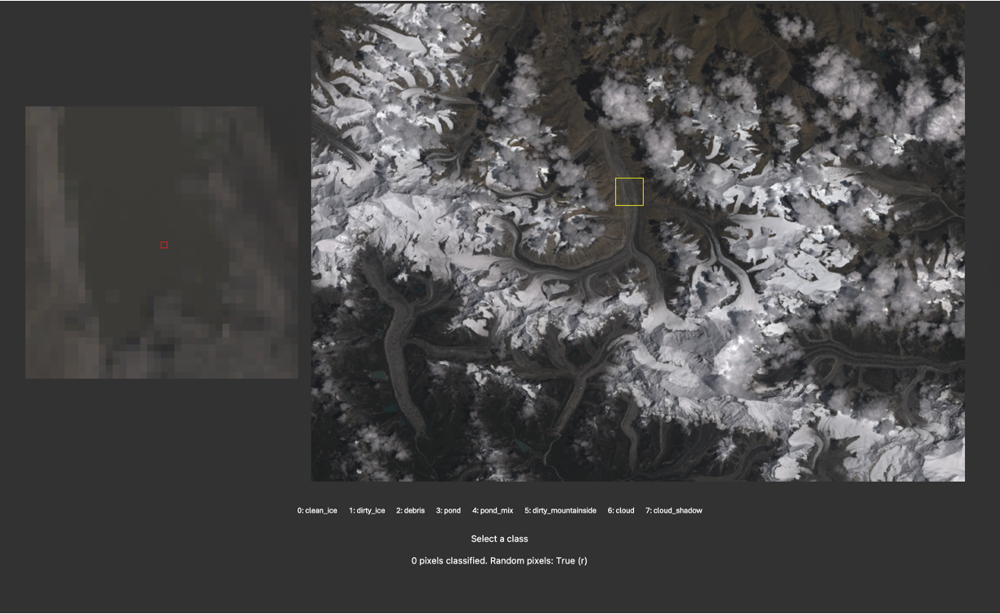
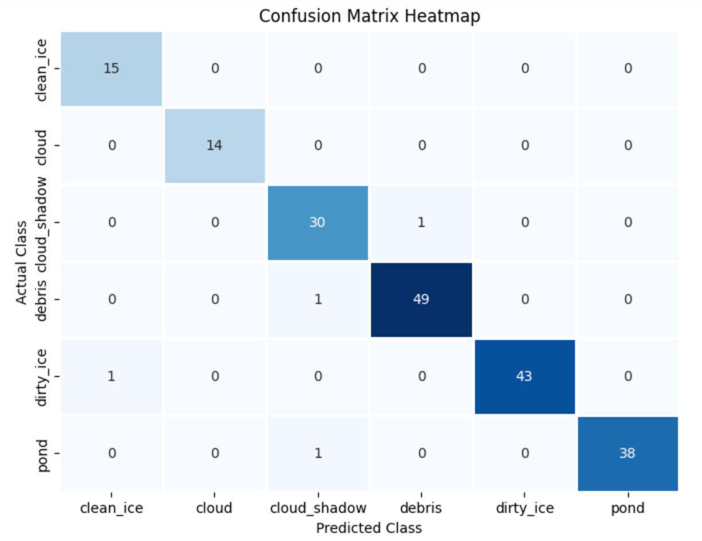

<figure style="position: relative; display: inline-block; margin: 0; border-radius: 12px; overflow: hidden;">
  
  <figcaption style="
    position: absolute;
    bottom: 0;
    left: 50%;
    transform: translateX(-50%);
    background: rgba(0, 0, 0, 0.5);
    color: white;
    padding: 4px 8px;
    font-size: 10px;
    font-weight: normal;
    text-align: center;
    width: 100%;
    border-bottom-left-radius: 12px;
    border-bottom-right-radius: 12px;
  ">
    Classified debris-covered glaciers in the Everest Region
  </figcaption>
</figure>

## Introduction

Presently, global and regional distributed debris thickness maps (e.g., Rounce et al., 2021; McCarthy et al., 2022) use a binary method of debris classification, whereby a pixel is either debris-covered (and has a measurable thickness) or it is clean ice. Such maps have a middle resolution, typically 30 m x 30 m, derived using satellite imagery.

At the sub-pixel level, surface type within middle-resolution imagery is heterogeneous. This has implications for glacier melt models, where the estimated melt is dependent on the surface type. Thick debris cover on debris-covered glaciers reduces melt compared to a climatologically equivalent clean-ice surface (Evatt et al., 2015). Below a critical thickness (typically 2–3 cm), debris cover enhances melt due to its lower albedo compared to clean ice. If both clean ice and debris-covered ice are present at the sub-pixel level, but a classification model only defines one surface type for the entire pixel, then subsequent melt estimates will be inaccurate.

Rounce et al. (2018) identify this as the 'mixed pixel' effect in the lower ablation area on glacier tongues. Debris cover appears thick in their models, which would result in a significant reduction in estimated sub-debris ablation. However, measured ablation is significantly higher due to unresolved sub-pixel scale supraglacial ponds and ice cliffs. Exposed ice at such low elevations as the glacier tongue results in highly concentrated areas of melt, which can even offset the reduced ablation beneath thick debris, regarded as the 'debris-cover anomaly' (Salerno et al., 2017).

My dissertation focused on the upper ablation area, where debris cover is initially developing and is thus sparse. Consequently, a similar mixed pixel effect is also occurring. I argue that it is especially important to understand debris thickness here, because the debris cover is so sparse and thin that it represents the turning point in debris’ influence on ablation – debris here could either be enhancing or reducing ablation. Therefore, understanding its influence is critical.

Such regions are poorly represented in regional and global distributed debris thickness maps. The figure below shows Rongbuk Glacier and its estimated debris thickness from Rounce et al. (2021) (C) and McCarthy et al. (B). Debris cover here is seen to be sparse, and also omitted in these datasets.

My dissertation sought to quantify debris thickness where it was omitted in these datasets. However, it also fell foul to portraying debris cover as continuous within a singular pixel. From the figure below (left), we can see that debris cover is not uniform at the sub-pixel level. My conclusion was thus:

> "Methods for estimating the fractional debris cover within low-resolution satellite-obtained pixels need to be developed so that the sparsely covered transition zone can be better represented in models of debris cover and its evolution, thereby permitting better projections of debris evolution and its resultant impacts on glacier dynamics in a changing climate" (p. 44).

<figure style="position: relative; display: inline-block; margin: 0; border-radius: 12px; overflow: hidden;">
  
  <figcaption style="
    position: absolute;
    bottom: 0;
    left: 50%;
    transform: translateX(-50%);
    background: rgba(0, 0, 0, 0.5);
    color: white;
    padding: 4px 8px;
    font-size: 10px;
    font-weight: normal;
    text-align: center;
    width: 100%;
    border-bottom-left-radius: 12px;
    border-bottom-right-radius: 12px;
  ">
    Debris thickness on Rongbuk Glacier, Tibet
  </figcaption>
</figure>

A starting point is to develop a classifier which is able to classify satellite imagery into clean ice, partially debris-covered (or ‘dirty ice’), and debris-covered pixels. The next step would be to develop algorithms which estimate the degree of debris cover at the sub-pixel level before employing a mixed melt model. Here, we tackle the starting point. The next step is the most interesting – it would require much higher resolution data, for instance, from UAVs, to provide ground truth data. Debris cover tends to be sparse because debris accumulates within topographic lows upon melting out. High resolution DEMs of the Himalayas do exist (e.g., 8 m x 8 m, Shean, 2017) and could be used to estimate the degree of redistribution within a lower resolution satellite-derived pixel. A future project!

## Supervised Learning

I am familiar with Landsat imagery, so let's use this to begin. Landsat 8 imagery is outputted as 30 m x 30 m and has a recurrence interval of 16 days over a given point. To classify Landsat imagery, I employ a supervised learning approach – a random forest classifier. 

So, let's manually classify some pixels for our model to learn from! Going through a satellite image, identifying the pixel type, and then logging its latitude and longitude manually is a lot of effort. Instead, I built a simple GUI to streamline the process: you drag and drop a satellite image and provide a CSV of desired classes. The program then shows you pixels, with their context, and allows you to quickly assign classes using the keyboard. Much faster!

<figure style="position: relative; display: inline-block; margin: 0; border-radius: 12px; overflow: hidden;">
  
  <figcaption style="
    position: absolute;
    bottom: 0;
    left: 50%;
    transform: translateX(-50%);
    background: rgba(0, 0, 0, 0.5);
    color: white;
    padding: 4px 8px;
    font-size: 10px;
    font-weight: normal;
    text-align: center;
    width: 100%;
    border-bottom-left-radius: 12px;
    border-bottom-right-radius: 12px;
  ">
    A quick program to quickly classify pixels for supervised learning
  </figcaption>
</figure>

## Producing a cloud-free image

Mountains are cloudy. Therefore, to create a classified map of debris cover of the Everest Region, we need to create a mosaic of cloud-free imagery over the entire region. Can we automate this? Certainly!

Let's add cloud cover (and cloud shadows) to our classified data. Now, we can train our model on our classed pixels and omit pixels classed as cloud cover.

We now have our classed pixels, manually classed with my 'expert' eye. Let's run our classifier using Google Earth Engine. I'm only using one image for now which certainly limits the capability of our classifier. Let's see how it performs before we consider adding more.

## Classification

### Training and Validation

Let's train our model on our classified satellite image. Let's split our data 70/30 into training and validation data, train our random forest classifier over all Landsat bands, and then apply it to validation data to assess its performance.

A confusion matrix can be used to evaluate classifier performance, which shows the actual class vs the model's predicted class. The confusion matrix below shows good performance – 97.9% overall! Not bad!

<figure style="position: relative; display: inline-block; margin: 0; border-radius: 12px; overflow: hidden;">
  
</figure>

### Application

Let's apply our trained classifier to every Landsat 8 image of the Everest Region. We'll then mask out all pixels classed as either cloud or cloud cover. We now have a collection of classified images for the region. Due to variability between images (and likely due to our limited classification data), pixels are sometimes classed differently between different Landsat acquisitions. Let's simplify this by taking the mode across our collection to reach a final pixel class.

## Classified Debris Map

And so, our result... showing debris and partial debris cover!

<figure style="position: relative; display: inline-block; margin: 0; border-radius: 12px; overflow: hidden;">
  
  <figcaption style="
    position: absolute;
    bottom: 0;
    left: 50%;
    transform: translateX(-50%);
    background: rgba(0, 0, 0, 0.5);
    color: white;
    padding: 4px 8px;
    font-size: 10px;
    font-weight: normal;
    text-align: center;
    width: 100%;
    border-bottom-left-radius: 12px;
    border-bottom-right-radius: 12px;
  ">
    Final classified debris map for the Everest Region
  </figcaption>
</figure>

## References

Evatt, G.W. et al. (2015) ‘Glacial melt under a porous debris layer’, Journal of Glaciology, 61(229), pp. 825–836. Available at: https://doi.org/10.3189/2015JoG14J235.

McCarthy, M. et al. (2022) ‘Supraglacial debris thickness and supply rate in High-Mountain Asia’, Communications Earth & Environment, 3(1), pp. 1–11. Available at: https://doi.org/10.1038/s43247-022-00588-2.

Rounce, D.R. et al. (2018) ‘Quantifying Debris Thickness of Debris-Covered Glaciers in the Everest Region of Nepal Through Inversion of a Subdebris Melt Model’, Journal of Geophysical Research: Earth Surface, 123(5), pp. 1094–1115. Available at: https://doi.org/10.1029/2017JF004395.

Rounce, D.R. et al. (2021) ‘Distributed Global Debris Thickness Estimates Reveal Debris Significantly Impacts Glacier Mass Balance’, Geophysical Research Letters, 48(8), p. e2020GL091311. Available at: https://doi.org/10.1029/2020GL091311.

Salerno, F. et al. (2017) ‘Debris-covered glacier anomaly? Morphological factors controlling changes in the mass balance, surface area, terminus position, and snow line altitude of Himalayan glaciers’, Earth and Planetary Science Letters, 471, pp. 19–31. Available at: https://doi.org/10.1016/j.epsl.2017.04.039.

Shean, D. (2017) ‘High Mountain Asia 8-meter DEM Mosaics Derived from Optical Imagery, Version 1’. NASA National Snow and Ice Data Center Distributed Active Archive Center. Available at: https://doi.org/10.5067/KXOVQ9L172S2.
