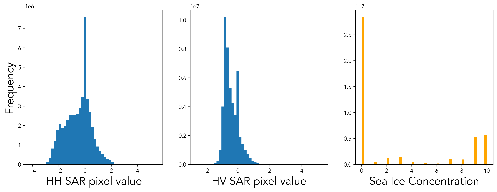
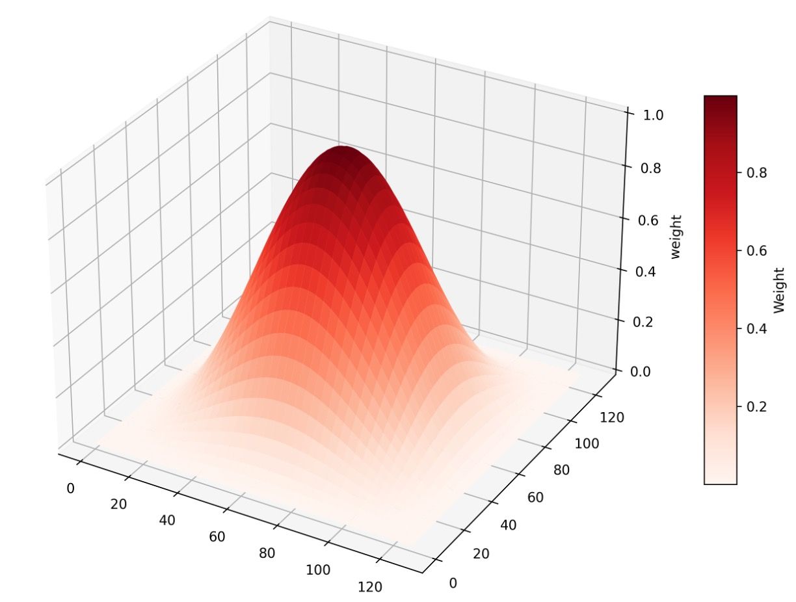
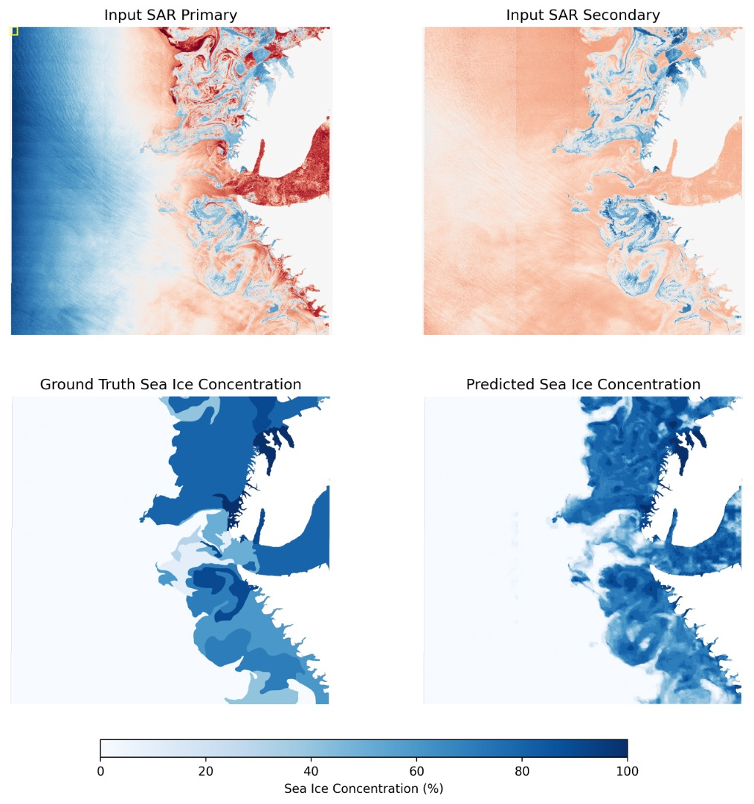

<!-- <figure style="position: relative; display: inline-block; margin: 0; border-radius: 12px; overflow: hidden;">
  
  <figcaption style="
    position: absolute;
    bottom: 0;
    left: 50%;
    transform: translateX(-50%);
    background: rgba(0, 0, 0, 0.5);
    color: white;
    padding: 4px 8px;
    font-size: 10px;
    font-weight: normal;
    text-align: center;
    width: 100%;
    border-bottom-left-radius: 12px;
    border-bottom-right-radius: 12px;
  ">
    Classified debris-covered glaciers in the Everest Region
  </figcaption>
</figure> -->

## Sea Ice


## Data

This project uses the labelled dataset from Buss-Hinker et al. (<a href="#Buus-Hinkler">2022</a>) which consists of 513 training and 20 test (without label data) scenes. Not wishing to download 200Gb+ of data onto my laptop (and then have to upload it into Google Colab), all model training and evluation was done on 10 labelled images (~5000x5000 pixels, 80 m resolution), split 80/20. Naturally, this limits the statistical power and generalisability of the results. Consequently, reported performance should be interpreted as a proof-of-concept rather than a definitive assessment of model skill, with further validation on a larger and more heterogeneous dataset required to robustly evaluate transferability and operational performance.

### Data pre-processing

Each labelled image has two SAR bands - Horizontal Transmit/Horizontal Receive (HH) and Horizontal Transmit/Vertical Receive (HV) - and labelled sea ice concentration (SIC), discretised into eleven 10% bin classes $[0,10]$. Land cover pixels are given a value of 0 in both SAR bands and a no-data value of 255 in the SIC band.

Distributions of pixel values are shown below:
<div align="center">
<figure style="position: relative; display: inline-block; margin: 0; border-radius: 12px; overflow: hidden;">
  
</figure>
</div>

Both SAR bands are roughly centered around 0, narrow, and continuous - no further scaling is required. Sea ice concentration targets were reescaled to $[0,1]$ and the task was treated as bounded regression. Land/no-data pixels were excluded from optimisation via a masked regression loss, with the mask computed per-image (and per-batch element) from the target no-data code, so gradients are accumulated only over valid ocean pixels.

500 random $128\times 128$ patches were sampled from each training image to produce a training dataset. A minimum ocean-pixel fraction per patch of 90% was used to [ ... ]

## Model

A U-Net style fully convolutional network was used to predict SIC from dual-polarisation SAR. Let $f_\theta (\cdot)$ denote the neural network paramaterised by $\theta$, where $\theta$ represents the trainable parameters and biases in the model. The network takes an input $\mathbf{x} \in \mathbb{R}^{H \times W \times 2}$ consisting of HH and HV channels. In the network, tensors are represented in channel-first format $(B, C, H, W)$.

### Architecture

The model follows a 4-level encoder–decoder with a bottleneck and skip connections (<a href="#Ronneberger">Ronneberger et al., 2015</a>). Each convolutional block applies a $3\times 3$ convolution with padding 1 (preserving spatial dimensions), followed by Group Normalisation (16 groups) and ReLU.

At each resolution level, two ConvBlocks are applied and the feature map is downsampled via $2 \times 2$ max pooling.

Skip tensors are retained for concatenation in the decoder. Channel widths are $[64, 128, 256, 512]$ across encoder levels.

Two ConvBlocks form the bottleneck with 1024 channels.

Each decoder stage upsamples using a $2\times2$ transposed convolution (stride 2), concatenates the corresponding skip connection along the channel dimension, and applies two ConvBlocks.

A $1 \times 1$ convolution maps the final 64-channel feature map to a single-channel SIC prediction with a sigmoid activation function:

$$
\hat{\mathbf{y}} = \sigma \left( \mathrm{Conv}_{1\times1}(\mathbf{z}_1) \right), \quad  \hat{\mathbf{y}} \in (0,1)^{H \times W}.
$$

During evaluation, predictions are rounded to the nearest 0.1:

$$
\hat{y} = \frac{\text{round}(10\hat{y})}{10}.
$$

### Loss Function

Loss was calculated as the mean square error over ocean/ice pixels. Non-ocean pixels have a pixel value of 25.5 in the target, and thus can be masked out from the loss calculation:

$$
\mathbf{m}=\mathbb{1}\left[\mathbf{y} \le 1\right]\in \{0,1\}^{H \times W},
$$

$$\mathcal{L}\_{\mathrm{MSE}}(\theta) = \frac{\sum m\_{ij}^{(b)}(\hat{y}\_{ij}^{(b)} - y\_{ij}^{(b)})^2}{\sum m\_{ij}^{(b)} + \varepsilon},$$

with small $\varepsilon > 0$ for stability.

Training, therefore, solves:

$$
\theta^{*} = \arg\min\_{\theta} \mathbb{E}\_{(\mathbf{x}, \mathbf{y}) \sim \mathcal{D}} \left[ \mathcal{L}\_{\mathrm{MSE}}(\theta) \right].
$$

## Output

Because the U-Net is trained on fixed-size $128 \times 128$ patches, full-scene prediction is performed using a sliding-window approach. The trained model is applied convolutionally across each large SAR image by extracting overlapping patches, predicting SIC for each patch, and recombining the outputs into a full-resolution prediction.

When patch predictions are stitched together using hard boundaries or uniform averaging, edge artefacts arise because pixels near edges have an incomplete spatial context for predictions. Consequently, a sliding Hann window, defined as:

$$
h(k) = \frac{1}{2}\left(1-\cos{\frac{2\pi k}{N-1}}\right),
$$

in one dimension, where $k=0, ... N-1$ and $N = 128$. In two dimensions it is defined as:

$$
w(i, j) = h(i)h(j),
$$

and looks like:

<div align="center">
<figure style="position: relative; display: inline-block; margin: 0; border-radius: 12px; overflow: hidden;">
  
</figure>
</div>

The final full prediction is then the weighted average:

$$
\hat{y}(i,j)=\frac{\sum_{p} w^{(p)}(i,j)\,\hat{y}^{(p)}(i,j)}{\sum_{p\in\mathcal{P}(i,j)} w^{(p)}(i,j)},
$$

where $p$ indexes all patches that cover pixel $(i, j)$, $\hat{y}^{(p)}(i, j)$ is the prediction for that pixel in patch $p$, and $w^{(p)}(i, j)$ is the Hann window weight for that pixel within patch $p$.

Running the model on a test image produces the following result:


<div align="center">
<figure style="position: relative; display: inline-block; margin: 0; border-radius: 12px; overflow: hidden;">
  
</figure>
</div>

The model reproduces the large-scale spatial structure and extent of sea ice concentration with high qualitative fidelity, capturing the overall geometry of the ice field and smooth transitions across the marginal ice zone. Predictions are spatially coherent and free from patch-boundary artefacts, indicating that the sliding-window inference and Hann-window blending are working as intended. However, the predicted field is noticeably smoother than the discretised ground truth, with sharp concentration gradients and local extremes damped. This behaviour is consistent with bounded regression trained under an MSE loss on limited data.

This apparent over-smoothing may in fact be more representative of real-world sea ice conditions than the discretised ground truth. Sea ice concentration is a fundamentally continuous physical variable, yet the reference product is quantised into coarse 10% bins, introducing artificial step changes and sharp boundaries that do not necessarily correspond to true physical transitions. Consequently, discrepancies at sharp bin boundaries may reflect limitations of the labelled product rather than genuine model error, and the predictions may be closer to the underlying physical state of the ice cover.

## Packaging

The full model code is available on [Github](https://github.com/eric-taylor-geo/sea-ice) and can be installed via:


<div style="
  background:#f7f7f7;
  border-left:4px solid #b07e4c;
  border-top-right-radius:10px;
  border-bottom-right-radius:10px;
">

```
git clone https://github.com/eric-taylor-geo/sea-ice.git
cd sea-ice
pip install .
```
</div>

The U-Net model can be loaded using:

**In [1]:**
<div style="
  background:#f7f7f7;
  border-left:4px solid #4c72b0;
  border-top-right-radius:10px;
  border-bottom-right-radius:10px;
">

```python
import seaice
from seaice.models.utils import get_model

model = get_model("unet", load_weights=True) # download weights
``` 
</div>

**Out [1]:**
```
Loaded weights for unet from seaice_weights/unet.pth
```

Predictions can be made using:

**In [2]:**
<div style="
  background:#f7f7f7;
  border-left:4px solid #4c72b0;
  border-top-right-radius:10px;
  border-bottom-right-radius:10px;
">

```python
from seaice.data.data import load_x_y
from seaice.predict.sliding_window import predict_sliding_window
from seaice.visualisation import plot_prediction

x_path = "seaice_data/test/X/20201013T080448_dmi_prep.nc" # download data
y_path = "seaice_data/test/Y/20201013T080448_dmi_prep_reference.nc"

input, target = load_x_y(x_path, y_path)
pred = predict_sliding_window(model, input, stride=64)

plot_prediction(input, target, pred)
```
</div>

**Out [2]:**
<div align="center">
<figure style="position: relative; display: inline-block; margin: 0; border-radius: 12px; overflow: hidden;">
  
</figure>
</div>

## References

<div id="references" style="text-indent:-2em; padding-left:2em;">

<p id="Buus-Hinkler">Buus-Hinkler, Jørgen; Wulf, Tore; Stokholm, Andreas Rønne; Korosov, Anton; Saldo, Roberto; Pedersen, Leif Toudal; et al. (2022). AI4Arctic Sea Ice Challenge Dataset. Technical University of Denmark. Collection. https://doi.org/10.11583/DTU.c.6244065.v2.</p>

<p id="Ronneberger">Ronneberger, O., Fischer, P. and Brox, T. (2015) U-Net: Convolutional Networks for Biomedical Image Segmentation. arXiv preprint arXiv:1505.04597. Available at: https://arxiv.org/abs/1505.04597.</p>


</div>

<script>
(function () {
  const OFFSET = 80;            // adjust for fixed header height
  const HIGHLIGHT_MS = 1800;    // how long the highlight lasts
  const COLOR = '#fff6a5';      // highlight color

  function highlight(id) {
    if (!id) return;
    const el = document.getElementById(id);
    if (!el) return;

    // scroll with offset (instead of relying on :target or scroll-margin)
    const y = window.pageYOffset + el.getBoundingClientRect().top - OFFSET;
    window.scrollTo({ top: y, behavior: 'smooth' });

    // apply a transient background highlight (retriggerable)
    el.style.transition = 'background-color 0.6s';
    el.style.backgroundColor = COLOR;
    void el.offsetWidth; // reflow to allow rapid re-highlighting
    setTimeout(() => { el.style.backgroundColor = 'transparent'; }, HIGHLIGHT_MS);
  }

  function highlightFromHash() { highlight(location.hash.slice(1)); }

  // Initial load (when URL already has #id)
  window.addEventListener('DOMContentLoaded', highlightFromHash);

  // When the hash actually changes
  window.addEventListener('hashchange', highlightFromHash);

  // Also handle clicks where the hash stays the same (no hashchange event)
  document.addEventListener('click', function (e) {
    const a = e.target.closest('a[href^="#"]');
    if (!a) return;
    const id = a.getAttribute('href').slice(1);
    if (!id) return;

    // Let the browser handle default link semantics, then force highlight + offset
    requestAnimationFrame(() => {
      // Optionally keep URL in sync without reloading
      try { history.replaceState(null, '', '#' + id); } catch (_) {}
      highlight(id);
    });
  });
})();
</script>

